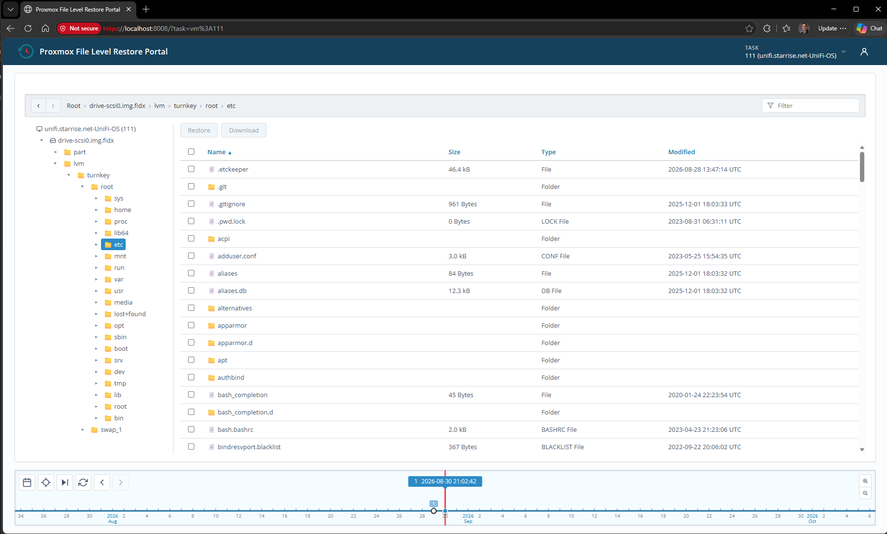

# Proxmox File Level Restore Portal (pve-flr-portal)

A small companion app for Proxmox VE + Proxmox Backup Server: a
scrubbable snapshot timeline and file browser for file-level restore,
in the spirit of Synology Active Backup for Business's restore portal.

Proxmox's own file-restore feature already does the hard part (safely
reading an arbitrary guest filesystem out of a backup via a throwaway
helper VM) — it's just missing a way to scrub across snapshots instead
of picking one at a time from a flat list. This project adds that on
top of Proxmox's existing API, without modifying Proxmox itself.



See [`docs/plan.md`](docs/plan.md) for the full architecture/reference
doc, [`TODO.md`](TODO.md) for open work, and
[`CHANGELOG.md`](CHANGELOG.md) for what's shipped in each release.

**Status: v1.2.0.** Browse and download files out of PBS backups
(single file, or a `.zip`/`.tar.gz`/`.tar.zst` bundle), scrub across
snapshots on a timeline, per-user PVE login, colour themes, and
**restore straight back into a running guest** via `qemu-guest-agent`
(single file, whole directories, and a faster Direct Network Transfer
path for large content). Reads from one or more PBS storages. See
`CHANGELOG.md` for the per-release detail and `TODO.md` for what's left
(mostly optional performance work and restore-path refinements).

Auth is per-user PVE ticket login — there's no shared service token.
See "Provisioning access" below for how to grant a user access.

## Using it

1. **Log in** with your own PVE username/password (realm dropdown,
   optional "save username").
2. **Task** (top right) picks which guest you're browsing — a
   filterable list of every guest with backups on the configured PBS
   datastore.
3. **The timeline** (bottom) is the point of the app: each dot is a
   snapshot; click one to select it (the callout jumps to it), drag to
   pan, use the zoom controls or a day with multiple snapshots to pick
   between them. The center line marks whatever snapshot is currently
   selected.
4. **Browse** the selected snapshot via the folder tree on the left or
   the breadcrumb bar above the file grid — both stay in sync with each
   other and with the timeline (switching snapshots keeps you in the
   same folder if it still exists there).
5. **Download** — select one file for a direct download, or select
   multiple files/folders (or a single folder) to get a "Download as"
   dropdown offering `.zip`, `.tar.gz`, or `.tar.zst`.
6. **Restore** writes the selection straight back into the *running*
   guest via `qemu-guest-agent`, instead of downloading it. The button
   is only enabled for guests where the agent is reachable and your PVE
   account holds the separate restore grant (see "Restore-to-guest"
   below); the confirmation dialog picks the destination directory and,
   where available, offers "restore metadata" / "verify". Large
   transfers use a Direct Network Transfer path automatically when a
   data NIC is configured.
7. **About** (user menu, top right) shows the running version and a
   link back to this repo.

## Running it

```
git clone https://github.com/treycentric/pve-flr-portal.git
cd pve-flr-portal

python -m venv .venv
source .venv/Scripts/activate   # .venv/bin/activate on Linux/macOS
pip install -r requirements.txt

cp .env.example .env
# edit .env: fill in PVE_HOST/PVE_STORAGE for your environment
# (PVE_STORAGE takes several comma-separated ids if you back up to more
#  than one PBS storage/namespace)

python run.py
```

The app serves HTTPS by default on port **8008** (a self-signed cert is
generated automatically on first run at `certs/portal.crt`/`portal.key`
if you haven't dropped in your own). Open **https://127.0.0.1:8008/** —
your browser will warn about the self-signed cert the first time; that's
expected for a homelab self-signed setup. Drop a CA-issued cert/key at
the same paths to replace it.

See "Provisioning access" below for how to grant a user the
`FileRestoreReader` role needed to browse and download (restore-to-guest
needs a separate grant, also covered there).

## Provisioning access

The portal never gets its own PVE credentials — every user logs in
with their own PVE username/password, and PVE's own permission system
decides what they can see. Onboarding a user is two ACL grants against
their existing account; no tokens or secrets to generate or hand off.

**1. Create the role** (once, on the PVE node — skip if it already
exists):

```
pveum role add FileRestoreReader -privs "Datastore.AllocateSpace,VM.Backup,VM.Audit"
```

`Datastore.AllocateSpace` + `VM.Backup` are what PVE's file-restore API
actually requires to read a backup volume (`Datastore.Audit` alone is
not enough); `VM.Audit` lets the portal resolve guest names for
display. See `docs/plan.md` §3 if you want the full "why" behind that
specific privilege set.

**2. Grant it to each user:**

```
pveum acl modify /storage/<storage-id> --users <user>@<realm> --roles FileRestoreReader
pveum acl modify /vms --users <user>@<realm> --roles FileRestoreReader
```

Replace `<storage-id>` with your PBS storage ID (matches `PVE_STORAGE`
in `.env`) and `<user>@<realm>` with the account (e.g. `alice@pam`,
`bob@ad`). Scope the second command to `/vms/<vmid>` instead of `/vms`
to limit which guests that user can see, rather than everything on the
datastore. If `PVE_STORAGE` lists several storages, run the first grant
once per storage id (or grant it on a parent path such as `/storage`) —
a storage a user has no access to is simply skipped, not an error.

**Equivalent GUI steps** (Datacenter → Permissions):
1. **Users** — confirm the account exists. Local `pve`-realm accounts
   need a password set here (`Datacenter → Permissions → Users → Edit`);
   PAM/LDAP/AD accounts just need their realm configured under
   `Datacenter → Realms`.
2. **Roles** — `Add` a role named `FileRestoreReader` and check
   `Datastore.AllocateSpace`, `VM.Backup`, `VM.Audit` (skip if the role
   already exists).
3. **Add → User Permission** — Path: `/storage/<storage-id>`, User: the
   account, Role: `FileRestoreReader`, Propagate: checked.
4. **Add → User Permission** (again) — Path: `/vms` (or a specific
   `/vms/<vmid>`), same User/Role, Propagate: checked.

### Restore-to-guest

Browsing and downloading only needs `FileRestoreReader` above.
Restoring a file directly back into a *running* guest via
`qemu-guest-agent` (see `docs/plan.md` §7.5–§7.7) is a **separate,
deliberate** grant — a user who can browse a backup should not
automatically be able to write into the live guest. It's never folded
into `FileRestoreReader`.

**Requires PVE 9+.** These are granular `VM.GuestAgent.*` privileges;
PVE 8 only has the coarse, all-or-nothing `VM.Monitor` and can't scope
this feature tightly, so it stays unavailable on PVE 8 regardless of
any role/ACL setup.

```
pveum role add FileRestoreOperator -privs "VM.GuestAgent.Audit,VM.GuestAgent.FileWrite"
pveum acl modify /vms/<vmid> --users <user>@<realm> --roles FileRestoreOperator
```

- `VM.GuestAgent.Audit` lets the portal ask the guest agent what it
  supports (capability detection) — grant it alongside either of the
  other two below, not on its own.
- `VM.GuestAgent.FileWrite` enables **quick restore**: small files
  written straight into the guest, landing `root:root`/SYSTEM, mode
  `0644`, fresh mtime — no further guest access needed.
- `VM.GuestAgent.Unrestricted` enables **full restore**: larger files,
  directories, and the optional "restore metadata" / "verify"
  upgrades. This is a much larger grant — Proxmox doesn't expose a
  narrower privilege for `guest-exec`, so anything that needs to run a
  command inside the guest needs this one. Add it only for guests
  where that broader access is acceptable:
  ```
  pveum role modify FileRestoreOperator -privs "VM.GuestAgent.Audit,VM.GuestAgent.FileWrite,VM.GuestAgent.Unrestricted"
  ```

The portal detects per-guest which of these the calling user actually
holds (plus what the guest agent itself allows) and only offers the
restore options that check out — see `docs/plan.md` §7.5.

## Deployment

**LXC on your PVE host (recommended).** Run on the PVE host itself:

```
bash deploy/lxc-create.sh
```

Creates an unprivileged Debian 12 container, installs the app, and
starts it as a systemd service (`pve-flr-portal`). Override
`CTID`/`STORAGE`/`BRIDGE`/`MEMORY_MB`/etc. via environment variables -
see the top of the script. Already have a container? Run
`deploy/install.sh` inside it instead. Rationale for LXC over a Debian
package on the host or a full VM/OVA is in docs/plan.md §10.

The systemd unit's `StateDirectory=` puts the app-state dir
(`PFR_DATA_DIR`) at `/var/lib/pve-flr-portal`, created and owned by the
service user. It survives `git pull` redeploys and container reboots,
but not a container recreate - see docs/plan.md §10 for what to
preserve when moving/rebuilding the container.

**Docker, mainly for local dev/testing:**

```
docker compose up --build
```

Reads `.env` from the repo root, persists the generated cert under
`./certs`, and keeps the app-state dir (`PFR_DATA_DIR`) in a named
volume (`pve-flr-data`) so it survives `docker compose down` and a
rebuild. This is how the download-format (.zip/.tar.gz/.tar.zst) and
login flows got exercised on both Python 3.14 (dev machine) and a
clean Python 3.11 (the deploy target) during development.

Testing Direct Network Transfer (the network-pull restore path,
docs/plan.md §7.6; internally "Design C")? `RESTORE_DATA_NICS`' address
needs to be one the container can actually bind to, which Docker's
default bridge networking won't give you (a container never has the
host's real LAN IP under it). Use the `hostnet` profile instead, which
gives the container the host's real interfaces directly (on Windows/Mac
this needs Docker Desktop's "Enable host networking" setting on first):
`docker compose --profile hostnet up --build pve-flr-portal-hostnet`.

**Data-plane TLS (issue #47, docs/plan.md §7.6.1).** Once
`RESTORE_DATA_NICS` is set, the download route is served over **HTTPS**,
and `RESTORE_DATA_NIC_TLS_PREFERRED` defaults to **`verify`** (the guest
validates the cert). A self-signed data-plane cert with the right IP
SANs is generated at `certs/data-plane.{crt,key}` unless you supply your
own; for `verify` to work the guest must trust it, so either
pre-install the CA or set `RESTORE_DATA_NIC_TLS_INSTALL_CA=if-missing`
to have the portal install it (via the guest agent, needing the same
`VM.GuestAgent.Unrestricted` grant restore already uses).
`RESTORE_DATA_NIC_TLS_PREFERRED` also takes `insecure` (encrypt, don't
validate) or `plaintext` (the pre-#47 HTTP behaviour); `..._MINIMUM`
sets the floor. A guest whose only fetch tool can't do the resolved
mode (`certutil`/`bitsadmin`/`bash` under `insecure`, `bash` under
`verify`) falls back to the chunked write path.

**If the portal container's IP changes** (or you point a data NIC at a
different address): update `local_ip` in `RESTORE_DATA_NICS` to match and
restart. The auto-generated `certs/data-plane.{crt,key}` regenerates
itself with the new IP SAN on restart — no manual step. If you supplied
your **own** data-plane cert, reissue it with the new IP/hostname in the
SAN; the portal won't touch an admin-supplied cert, it only logs a
"does not cover" warning and `verify` clients then reject it. (The main
UI cert is unaffected — it's keyed to `PVE_HOST`/`localhost`, not the
container IP.)

## Tests

```
./run-tests.ps1     # Windows (PowerShell)
./run-tests.sh      # Linux / macOS / Git Bash
```

Covers lint (`ruff`), Python (`pytest`), the `app.js` frontend logic
(`node --test`), and CSS (`stylelint`). See [`tests/README.md`](tests/README.md).
Runs in CI on every push/PR and again as a release gate — see
[`docs/dev/versioning.md`](docs/dev/versioning.md).

## Versioning & releases

Semantic Versioning + Conventional Commits + Keep a Changelog — see
[`CHANGELOG.md`](CHANGELOG.md) for what shipped and
[`docs/dev/versioning.md`](docs/dev/versioning.md) for the full
convention and how to cut a release with `scripts/release.py`.

## License

Licensed under the [GNU Affero General Public License v3.0](LICENSE)
(AGPL-3.0). Because AGPL is copyleft with a network-use clause, anyone
who runs a modified version of this app as a network service must also
make that modified source available to its users.

Third-party attribution (the app icon is derived from a WordPress
Dashicons glyph via SVG Repo) is in [`NOTICE`](NOTICE).
