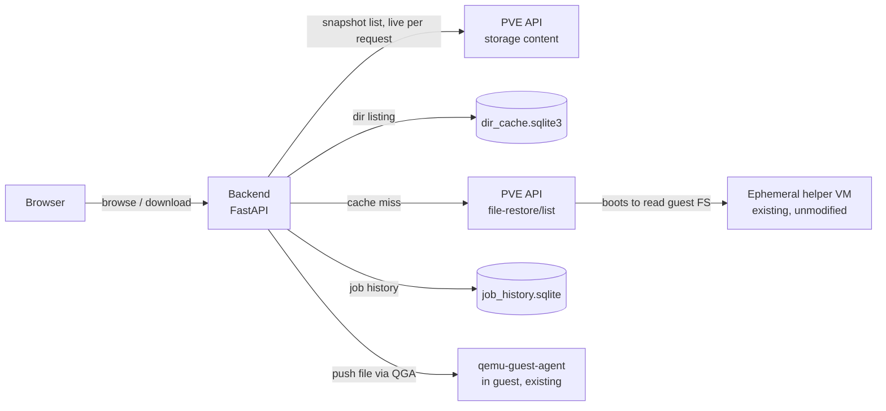

# Architecture

Living developer reference for how the system works today — current
design, not how it got that way. For the undocumented PVE/QGA API
contracts this app depends on, see [`api-reference.md`](api-reference.md).
For push-to-guest restore's mechanism, see [`push-to-guest.md`](push-to-guest.md).
For *why* a given design was chosen over alternatives, or the history
of bugs found and fixed along the way, see [`archive/`](archive/) —
this doc stays in the present tense on purpose.

## Overview

Nothing here modifies Proxmox. The app is a small FastAPI backend that
carries the logged-in user's own PVE session, plus two small SQLite
caches, plus the browser-facing UI.



The app is otherwise stateless: the snapshot list and any not-yet-cached
directory listing are read live from the PVE API on each request. The
two exceptions are both single SQLite files under `PFR_DATA_DIR` (issue
#30), written from the request path, never a background job:

- `dir_cache.sqlite3` — a lazily-populated cache of `file-restore/list`
  responses (issue #109). See "Data model" below.
- `job_history.sqlite` — persisted restore-job records and logs (issue
  #124). See "Data model" below.

## Multiple backup storages / PBS namespaces

`PVE_STORAGE` accepts a comma-separated list of PBS-backed storage ids,
not just one. PVE keeps a storage's PBS namespace inside its own config
(`/etc/pve/storage.cfg`) and never surfaces it in the volid, so from
this app's side "N namespaces" is just "N storage ids" — no
namespace-aware API call is needed anywhere.

- **Enumeration** (`pve_client.list_backup_archives`) queries
  `storage/{id}/content?content=backup` for every configured storage and
  concatenates the results, returning `BackupListing(archives, errors)`.
  A storage the user can't read (403) or that's briefly unreachable is
  recorded in `errors` and skipped, never raised — one misconfigured
  storage can't take down the whole portal. `index()` shows a
  non-blocking warning banner for anything in `errors`. A `401` (bad
  ticket) still propagates to the auth handler.
- **Per-snapshot calls** (`file-restore/list`, `download`, every
  push-to-guest path) take the full volid as `volume` and derive the
  storage id from the volid's own prefix (`pve_client._storage_of`) —
  there's no module-level "the" storage.
- **Grouping/timeline:** a guest's recovery points from all storages
  merge into one per-guest timeline, keyed by `(type, vmid)`. This
  assumes `vmid` is unique cluster-wide; two different guests sharing a
  vmid across clusters would collide into one timeline — a documented
  limitation, not a supported topology.
- **Config:** `settings.pve_storages` (tuple) is the real value;
  `settings.pve_storage` is a convenience property returning the first
  id for callers that only need "a" storage.

## Data model

### `dir_cache.sqlite3`

```sql
CREATE TABLE dir_cache (
  username      TEXT NOT NULL,        -- session_data.username, e.g. 'alice@pam'
  volume        TEXT NOT NULL,        -- full volid, e.g. 'pbs:backup/vm/132/2026-08-29T14:48:06Z'
  path          TEXT NOT NULL,        -- the opaque filepath token from file-restore/list ('/' for root)
  listing_json  TEXT NOT NULL,        -- verbatim file-restore/list response
  fetched_at    TEXT NOT NULL,
  PRIMARY KEY (username, volume, path)
);
```

Keyed by `username` as well as `(volume, path)`: file-restore access is
permission-gated per PVE ticket, so a listing cached under one user must
never be served to a different user, even for the identical volume/path
— `pve_client.list_path()`'s in-flight-call coalescing uses the same
key for the same reason.

A backup snapshot is immutable, so a cached `(username, volume, path)`
listing never goes stale on its own. What *can* change: the snapshot
itself can disappear (PBS retention pruning, a manual delete), or the
user's own access to it can be revoked — `get()` never re-checks
permission on a hit, so without reconciliation a revoked user could
keep reading out everything they'd cached before. `evict_missing()`
(called from `index()`, right after its own live, permission-filtered
`list_backup_archives()` call) drops any cached volume not in that same
request's result, scoped per-user. Skipped entirely when the archive
listing came back with errors, so a transient PVE hiccup never looks
like "nothing exists anymore."

### `job_history.sqlite`

Two tables — one row per job, one row per log line:

```sql
CREATE TABLE jobs (
  id                TEXT PRIMARY KEY,
  requested_by      TEXT NOT NULL,
  device            TEXT NOT NULL,
  task_name         TEXT NOT NULL,
  restore_version   TEXT NOT NULL,
  source            TEXT NOT NULL,
  destination       TEXT NOT NULL,
  status            TEXT NOT NULL,
  progress_percent  INTEGER,
  elapsed_seconds   REAL,
  error             TEXT,
  cancellable       INTEGER NOT NULL,
  started_at        REAL NOT NULL,
  finished_at       REAL,
  updated_at        REAL NOT NULL
);

CREATE TABLE job_log_entries (
  id      INTEGER PRIMARY KEY AUTOINCREMENT,
  job_id  TEXT NOT NULL REFERENCES jobs(id) ON DELETE CASCADE,
  line    TEXT NOT NULL
);
```

`jobs` columns mirror `RestoreJob.to_dict()`'s fields — the already-
computed values, not raw state, so the read side never has to duplicate
`RestoreJob`'s own clamping/pinning logic. A `jobs` row is upserted at
job creation and at every coarse status transition
(`RestoreJobManager.create()`/`mark_running()`/`mark_verifying()`/
`mark_done()`/`mark_failed()`/`mark_cancelled()`). A `job_log_entries`
row is appended on every `RestoreJob.log()` call, independent of those
status writes, so an interrupted job's persisted log is current up to
the last line actually logged. `ON DELETE CASCADE` requires `PRAGMA
foreign_keys = ON` on the connection (off by default in sqlite3 even
when the schema declares a foreign key).

Writes are synchronous (not `asyncio.to_thread`-wrapped like
`dir_cache`'s reads) — job status transitions and log lines are
infrequent enough per job (restore_runner.py throttles its own `log()`
calls to roughly one per percentage point or every few seconds, never
once per chunk/byte) that a brief blocking write is an acceptable
tradeoff. Reads (`get`/`list_recent`/`evict_expired`/
`reconcile_interrupted`) use `asyncio.to_thread` since they run from
async routes/the startup hook, where blocking the loop would stall
every other concurrent request.

`GET /api/restore-jobs`/the detail endpoint merge this process's live,
in-memory `RestoreJobManager` jobs with `job_history`'s persisted rows
for anything this process didn't itself create (a live job always wins
over its own stale persisted snapshot, keyed by id) — this is what lets
a job survive a restart within `JOB_HISTORY_RETENTION_DAYS`.
`evict_expired()` prunes terminal jobs past that window, called
opportunistically from the list endpoint on every load — independent of
restarts; it's a time-based sweep, not a restart-recovery mechanism.
`reconcile_interrupted()` runs once at startup (`main.py`'s `lifespan`
hook), before serving any request: any row still
`queued`/`running`/`verifying` at that point is necessarily left over
from a previous process, and is closed out to `RestoreStatus.INTERRUPTED`
— a terminal status distinct from `FAILED`, since nothing about the
restore itself failed.

## Auth & sessions

Per-user PVE ticket login — there is no shared service token, and the
app never talks to PBS directly. All backup listing goes through PVE's
own `GET /nodes/{node}/storage/{storage}/content?content=backup`.

- **Login:** `POST /login` calls PVE's `POST /access/ticket`
  (`{username: "user@realm", password}`), which returns `{username,
  ticket, CSRFPreventionToken, cap}`. The realm `<select>` is populated
  from the unauthenticated `GET /access/domains`
  (`auth.list_realms()`), which retries a few times then falls back to
  the `pam`/`pve` realms every PVE install has, and never raises.
- **Session store:** an in-memory dict (`auth._sessions`), keyed by an
  opaque session id, holding `SessionData {username, ticket, csrf_token,
  ticket_issued_at, last_activity_at, cap}`. The browser only ever holds
  this app's own `HttpOnly`/`SameSite=Lax` session cookie (`Secure` too,
  whenever served over HTTPS), never the raw PVE ticket.
- **Outbound PVE calls** send `Cookie: PVEAuthCookie=<ticket>`;
  state-changing calls also send the `CSRFPreventionToken` header.
- **Ticket refresh:** `auth.get_session()` refreshes a session's PVE
  ticket inline on any request once it's more than 90 minutes old (PVE
  tickets expire at ~2h) — a lazy check on the request path, not a
  background timer. A refresh PVE rejects evicts the session (401,
  redirect to `/login?reason=expired`) rather than 500ing.
- **`cap`** is the privilege-bucket field PVE's own `/access/ticket`
  response already carries (`PVE::RPCEnvironment::compute_api_permission`),
  captured into `SessionData` and refreshed on every ticket renewal.
  `cap["dc"][priv]` means a privilege was granted at the bare root path
  `/` specifically (PVE's bucketing falls through to `"dc"` only when a
  grant has no second path segment to match) — this is what
  `auth.is_job_admin()` checks for the `RESTRICT_JOBS_TO_OWN` bypass
  (issue #122).
- **2FA (TOTP/recovery keys, issue #15):** PVE's `/access/ticket`
  returns `NeedTFA: 1` plus an opaque, signed intermediate value in
  `ticket` when a second factor is required. `auth.login()` raises
  `TFARequired(challenge, username)` in that case; `finish_tfa_login
  (username, code, challenge)` does the second `/access/ticket` call,
  sending the entered code in `password` — prefixed `totp:` or
  `recovery:` (PVE silently rejects an unprefixed code; a recovery key
  is always four hyphenated 4-hex-digit groups, so the prefix is
  unambiguous without a second input field) — and the challenge value
  in `tfa-challenge`. `username` must be PVE's own returned value, not a
  client-reconstructed `user@realm` string — the challenge is
  cryptographically bound to PVE's normalized username. WebAuthn is out
  of scope (needs browser credential-API JS, not a text field).

### OIDC/SSO realm login (issue #56)

A PVE realm can be `type: openid`. Two calls, matching
`pve-access-control`'s `PVE/API2/OpenId.pm`:

- `POST /access/openid/auth-url` — `{realm, redirect-url}` → the
  identity provider's authorization URL. `redirect-url` is this app's
  own callback (`/login/oidc/callback`, computed via `request.url_for`
  on both legs rather than a hardcoded public-URL setting) — the
  identity provider's OIDC client for that realm must separately
  allow-list it.
- `POST /access/openid/login` — `{state, code, redirect-url}` → the same
  `{username, ticket, CSRFPreventionToken, cap}` shape `/access/ticket`
  returns. No `realm` param — PVE encodes it into `state`, so this app
  tracks no flow state between the two legs.

`main.py` registers `/login/oidc/callback` **before**
`/login/oidc/{realm}` — Starlette matches path routes in registration
order, and the dynamic route would otherwise swallow the literal
callback path.

### Idle timeout

Independent of PVE's own ticket lifetime: `SESSION_IDLE_TIMEOUT_MINUTES`
(default 30) force-expires a session that's seen no genuine activity,
regardless of whether its PVE ticket could still be refreshed.

- `last_activity_at` updates on every authenticated request **except**
  the restore-jobs list/log pollers (`auth.get_session_keepalive`,
  which validates and enforces the timeout but doesn't reset it) — an
  open tab polling every ~4s must not keep a session alive forever.
- Enforced in the same dependency that resolves the current session:
  past the threshold, the session is cleared and the request treated as
  logged-out.
- `get_session()` raises 401 for a lapsed session. `main.py`'s global
  exception handler branches on request shape: an `HX-Request` gets
  `HX-Redirect`; another `/api/*` call gets a plain 401 JSON body (a 302
  would be silently followed by `fetch()`); a page navigation gets a
  302. `apiFetch()` in `app.js` redirects to `/login?reason=expired` on
  401, guarded against a redirect storm from the poll loop.

### TLS

The app serves HTTPS by default. `backend/tls.py`'s
`ensure_self_signed_cert(cert_path, key_path)` generates a self-signed
cert (tagged `O = pve-flr-portal (auto-generated)`, ~2 year validity,
written atomically) only if both `TLS_CERT_FILE`/`TLS_KEY_FILE` don't
already exist; an admin-supplied pair at those paths is used as-is and
never overwritten. A broken pair is re-issued in place only if it's one
of this app's own auto-generated certs — a broken admin-supplied cert
is logged as an error and left untouched. This runs in `run.py` before
`uvicorn.run(..., ssl_certfile=..., ssl_keyfile=...)`, since it has to
happen before uvicorn binds its SSL context — too late for a FastAPI
startup hook. Each data-plane listener's own SSL context load is
wrapped separately, so a bad data-plane cert skips only that listener.

This is orthogonal to `PVE_VERIFY_SSL`, which is about this app
trusting *PVE's* cert when calling out to it, not this app's own
listener.

## Stack

- **Backend:** Python, FastAPI — one process, typed surface for a
  handful of endpoints.
- **Storage:** otherwise stateless; `dir_cache.sqlite3` and
  `job_history.sqlite` under `PFR_DATA_DIR` are the only exceptions (see
  "Data model" above).
- **Frontend:** server-rendered HTML + htmx + Alpine.js — no build
  pipeline, no bundler.
- **Timeline widget:** hand-rolled inline SVG — no charting library
  covers "date axis, one dot per discrete event, drag to scrub, zoom."

This is a tool one person maintains occasionally — optimize for low
ongoing maintenance over architectural purity.

## Known risks

- **Undocumented API.** `file-restore/list` isn't in Proxmox's published
  API reference (see [`api-reference.md`](api-reference.md)) — it could
  shift shape across a PVE upgrade with no changelog pointing at it.
  Mitigation: pin against a known-good PVE version, re-run recon after
  any upgrade.
- **Cold-lookup latency.** ~3s for an uncached directory (the helper VM
  booting) — inherent to how file-restore works. The UI needs an honest
  loading state, not a pretense of instant response.
- **Filesystem coverage.** file-restore only understands common
  filesystems (ext4, XFS, NTFS, FAT and similar) — an exotic layout may
  simply not browse.
- **PBS dependency.** No PBS → nothing works. A site without PBS, or a
  datastore that goes offline, takes the whole app's data source with
  it — there is no vzdump fallback.
- **`localhost` node segment.** Storage-scoped calls (`file-restore/*`,
  `storage/{id}/content`) are always called with the literal node name
  `localhost` — PVE proxies these cluster-wide, so this is correct even
  on a multi-node cluster. Guest-scoped calls (`agent/*`, `/config`)
  instead resolve the guest's real node via `/cluster/resources`
  (`pve_client.resolve_guest_node()`), falling back to `localhost` when
  resolution fails or isn't needed. A guest that migrates mid-restore
  isn't handled — the resolved node goes stale and the job fails
  cleanly; not a supported scenario.

## Scaling & limits

Deliberately single-process, single-worker, in-memory. Scales to its
stated target — one admin, a handful of guests, occasional file
recovery, one or a few concurrent users — and hits walls outside that.
These are design consequences, not defects.

**Hard ceilings (need real work to lift):**

- **`/api/download-bundle` memory + event-loop block.** Reads every
  selected file fully into RAM, builds the whole archive in a
  `BytesIO`, and compresses synchronously on the event loop — a
  multi-GB selection OOMs the worker and stalls every other request
  while compressing. Single-file `/api/download` streams and is
  unaffected. Fix: stream the archive as it's built; move compression
  to a thread.
- **Helper-VM stampede.** Proxmox boots an ephemeral helper VM per cold
  snapshot browsed and exposes no API to list or stop one directly.
  `pve_client.list_path()` mitigates this in order: a `dir_cache` hit
  skips everything else; identical concurrent requests (keyed by
  `(username, volume, filepath)`) are coalesced; remaining calls are
  capped by a semaphore (`FILE_RESTORE_LIST_MAX_CONCURRENCY`, default
  **2**). `file-restore/list` is `protected => 1` in PVE's own API code,
  so it always runs on `pvedaemon` specifically — a shared, node-wide
  worker pool (`max_workers => 3` by default) used for every privileged
  PVE API call, not just this app's traffic, and every helper VM boots
  on `PVE_HOST`'s node regardless of which node the actual guest lives
  on. Raising PVE's own `MAX_WORKERS` (`/etc/default/pvedaemon`) is a
  legitimate lever for an admin with headroom, but it's a node-wide
  capacity change affecting every privileged API call on that node, not
  something scoped to this app.
- **No pagination.** A directory with tens of thousands of entries
  returns the full list, renders every row, and the client
  sorts/filters all of it in JS.

**Softer limits:**

- **LVM elevation** (`_discover_lvm_volumes`) probes every root-level
  disk on every VM-guest root browse to check for an `lvm` folder, even
  for a guest with no LVM — no cache for this probe specifically, so
  the cost repeats on every root view.
- **In-memory sessions + `reload=True`, one worker** (`run.py`) — can't
  run multiple uvicorn workers or scale horizontally; each worker would
  have its own `auth._sessions`. `reload=True` is a dev setting.
- **`httpx.AsyncClient` per call** — every `pve_client` function opens a
  fresh client, no connection pooling. Negligible at this app's scale.
- **`index()` is O(all archives on the datastore)** per page load,
  uncached.
- **Client timeline redraw** — `renderTimeline()` tears down and
  rebuilds all SVG nodes every pan frame; smooth at a few hundred dots,
  drops frames at multi-year retention (thousands).

**Fine as-is:** streaming single-file download, the auth/session path,
the live snapshot-list call (one PVE request, no helper VM), the
timeline at a realistic backup-retention count.
