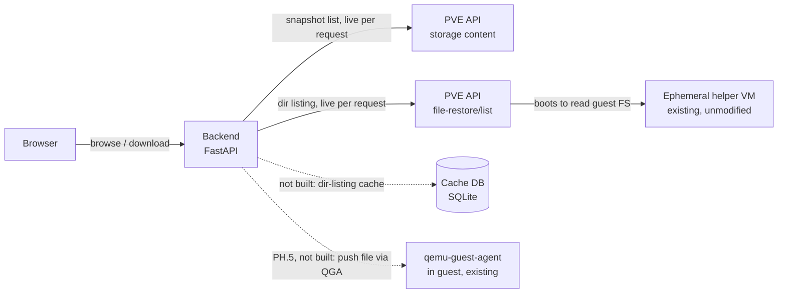

# Archived: development history, Phases 0-4 (through v1.0.0)

> **This is a frozen historical snapshot**, not living documentation.
> It's `docs/plan.md` exactly as it stood when PH.0-PH.4 wrapped up and
> versioning started at `v1.0.0` — kept for the debugging war stories
> (the `setPointerCapture` click-retargeting bug, the SVG `viewBox`
> distortion bug, the oversized-hit-area bug, and the "verifying with
> `dispatchEvent` bypasses hit-testing" testing lesson are all worth
> knowing before touching `backend/static/app.js`'s timeline code
> again) and as a record of how the early design decisions were made.
> For current architecture/reference docs, see `docs/plan.md`. For
> open work, see `TODO.md`. For what shipped in each release, see
> `CHANGELOG.md`.

# Restore Timeline — implementation plan

A companion web app for Proxmox VE + Proxmox Backup Server: a scrubbable
snapshot timeline and file browser for file-level restore, in the spirit
of Synology Active Backup for Business's restore portal. Proxmox's own
file-restore feature already does the hard part — safely reading an
arbitrary guest filesystem out of a backup via a throwaway helper VM —
it's just missing a way to scrub across snapshots instead of picking one
at a time from a flat list. This adds that on top of Proxmox's existing
API, without modifying Proxmox itself.

## 1. Why

Every backup in Proxmox VE's GUI is a separate, flat list entry. To
compare a file across two points in time you back out, pick a different
snapshot, and re-navigate to the same folder by hand. Active Backup for
Business's restore portal has the piece Proxmox lacks: a horizontal
timeline along the bottom, one dot per recovery point, that you drag or
click to scrub through history while the file listing above updates in
place. That scrubber — and the small service behind it — is what this
project builds.

## 2. Scope & the decisions already made

This ships as a **separate companion app**, not a patch to the Proxmox
web UI — Proxmox's GUI has no plugin system, so there's no clean seam to
inject a new panel into the existing Backups tab.

**Proxmox Backup Server is a hard requirement.** The whole app is built
on Proxmox's "File Restore" feature (`file-restore/list` / `download`,
§3), and per Proxmox's own docs that feature *"is only available for
backups on a Proxmox Backup Server."* Plain `vzdump` backups on
directory / NFS / CIFS storage cannot be browsed file-by-file through
any API — recovering a file from those is a manual `vma extract` +
loop-mount on the CLI, which this app does not and cannot wrap. If a
site has no PBS, this tool has nothing to show. (Secondary point: PBS
also keeps many retained recovery points per guest cheaply via dedup,
which is what makes a *timeline* worth scrubbing; a handful of rotated
vzdump files would barely fill one.)

On feature parity with ABB: **build browse-and-download first, matched
closely to the ABB layout. Treat "restore directly into the original,
running VM" as a distinct later phase (PH.5) with its own design.**
ABB can write a restored file straight back onto the source machine by
connecting to it through **VMware Guest Tools** (already installed for
normal VM management) and authenticating **as a guest OS user** with
credentials the operator supplies to the restore tool — it is not a
Synology-specific agent. Proxmox's file-restore API stops one step
earlier: it hands you bytes, full stop. Getting those bytes back into a
*live* guest's filesystem needs an in-guest channel — and Proxmox
already ships the equivalent of VMware Guest Tools: **`qemu-guest-agent`
(QGA)**, the same agent the backup path uses for fs-freeze. QGA can
write files and run commands in the guest, as root/SYSTEM, with **no
guest credentials required** — the authorization is a per-user PVE
privilege (`VM.GuestAgent.*`), not a guest password. So PH.5 does *not*
need a bespoke listener daemon; it needs a careful design on top of QGA.
See §7.4 for the mechanism, limits, and scope. It still belongs in PH.5,
not the MVP.

## 3. Phase 0 recon findings — CONFIRMED

Captured from the real Proxmox VE GUI (browser devtools, network tab)
on 2026-08-29. This replaces guesswork with an observed contract.

**Endpoint:** the call goes through **PVE's own API**, not PBS's admin
API directly:

```
GET https://<pve-host>:8006/api2/json/nodes/localhost/storage/<storage-id>/file-restore/list
    ?volume=<storage-id>:backup/<type>/<vmid>/<snapshot-timestamp>
    &filepath=<path>
```

Observed real example (root listing):
```
GET /api2/json/nodes/localhost/storage/pbs/file-restore/list
    ?volume=pbs:backup/vm/132/2026-08-29T14:48:06Z
    &filepath=/
```

Observed real example (drilling into a disk):
```
GET /api2/json/nodes/localhost/storage/pbs/file-restore/list
    ?volume=pbs:backup/vm/132/2026-08-29T14:48:06Z
    &filepath=L2RyaXZlLXNjc2kwLmltZy5maWR4
```
`L2RyaXZlLXNjc2kwLmltZy5maWR4` base64-decodes to `/drive-scsi0.img.fidx`.

**Confirmed quirks worth remembering:**
- The **node segment is literally the string `localhost`**, not the
  real hostname — PVE resolves it to whichever node the request lands
  on. Our backend can always use `localhost` here.
- `filepath=/` for the root is passed as a **literal, unencoded `/`**
  (URL-encoded by the browser to `%2F`). Any path *deeper* than root is
  **base64-encoded** first, then URL-encoded. Don't assume one encoding
  scheme for both cases.
- `volume` is the familiar PVE volid shape:
  `<storage-id>:backup/<vm|ct>/<vmid>/<ISO8601 backup timestamp, Z-suffixed>`.
- Auth on this request used the GUI's normal session ticket
  (`PVEAuthCookie` cookie) plus a `CSRFPreventionToken` header — **not**
  yet confirmed to work with a scoped API token. This is the next thing
  to verify before phase 1 starts: whether `file-restore/list` accepts
  `Authorization: PVEAPIToken=user@realm!token=secret`, or requires a
  real ticket. Some Proxmox endpoints that proxy to internal helper
  daemons have historically been picky about this.
- **Timing confirms the cold-lookup risk directly:** the root listing
  returned in 84ms; drilling one level into the actual disk image took
  **3.08s** — that's the helper VM booting to read the filesystem. Any
  UI built on this needs an honest loading state for that gap, and the
  caching plan below is not optional polish, it's load-bearing.

**Phase 0 — CLOSED, 2026-08-29.** The two remaining open items were
resolved by consulting Proxmox's own published API schema (the data
file behind `https://pve.proxmox.com/pve-docs/api-viewer/`, not just
the human-readable page — it ships the full machine-readable spec for
every endpoint, including the internal ones used by the GUI):

- **API-token auth is officially supported.** Both
  `file-restore/list` and `file-restore/download` are marked
  `"allowtoken": 1` in the schema. No session-ticket fallback needed —
  the backend can hold a single scoped `PVEAPIToken=user@realm!token=secret`
  and use it for every call.
- **Permissions are minimal.** Both endpoints require only
  `"You need read access for the volume."` (`"user": "all"` — any
  authenticated principal with read access to that volume, no special
  admin role). This confirms a narrowly-scoped token is sufficient, no
  elevated privileges needed on the PVE side.
- **`file-restore/download` contract, from the schema:**
  ```
  GET /api2/json/nodes/{node}/storage/{storage}/file-restore/download
      ?volume=<volid>
      &filepath=<base64-path-or-/>
      &tar=<0|1>            (optional, default 0)
  ```
  - `tar=1` downloads a directory as `tar.zst` instead of the default
    `zip`.
  - `returns: {"type": "any"}` — a raw byte stream, not JSON. This
    also explains why clicking Download in the GUI didn't show up as
    an XHR/fetch entry during manual traffic capture: it's most likely
    a direct browser navigation to the URL (`window.location` or an
    `<a>` click) rather than an ajax call, so it wouldn't appear under
    a Fetch/XHR devtools filter. No further capture needed — the
    schema is authoritative and matches the confirmed `list` shape
    (same `volume`/`filepath` encoding).
- **`file-restore/list` response schema, from the same source:**
  array of objects: `{filepath: string (base64), leaf: boolean,
  mtime?: integer (unix ts), size?: integer, text: string, type:
  string}`. This matches the request/latency behavior already
  captured empirically above.
- **Confirmed quirk (2026-08-29, real usage):** navigability is
  governed by **`leaf`**, not `type`. At the root listing, a virtual
  disk (e.g. `drive-scsi0.img.fidx`) has `type: "f"` but `leaf: false`
  — it looks like a file but is actually drillable, and drilling into
  it is how you reach the guest's real filesystem. Any UI must branch
  on `leaf`, not on `type == "d"`, to decide whether an entry is
  clickable/browsable. Getting this backwards makes the root disk
  entry look like a terminal file, which also leads users to try
  downloading the raw disk blob directly (returns an empty/degenerate
  response — that endpoint isn't meant for that).

No live response-body capture was ultimately needed — the published
schema is authoritative for shape, and the empirical capture already
locked down timing and encoding quirks the schema doesn't document.

**Scoped token setup.** (Note: the currently-deployed service accounts
predate the project rename to pve-flr-portal and are still named
`pve-backup-portal@titan` / `pve-backup-portal@pbs` on the real PVE/PBS
servers — the `pve-flr-portal@...` names below are the convention for
new setups, not a claim that the live accounts were renamed.)
`PVE::Storage::check_volume_access` (pve-storage
source) requires, for a `backup`-type volume, *both*
`Datastore.AllocateSpace` on `/storage/{storage}` *and* `VM.Backup` on
`/vms/{vmid}` — `Datastore.Audit` alone is not sufficient for this
content type. Commands to create the scoped PVE token (run on the PVE
node):

```
pveum role add FileRestoreReader -privs "Datastore.AllocateSpace,VM.Backup"
pveum user add pve-flr-portal@pve --comment "pve-flr-portal service account"
pveum user token add pve-flr-portal@pve portal --privsep=1
pveum acl modify /storage/<storage-id> --tokens 'pve-flr-portal@pve!portal' --roles FileRestoreReader
pveum acl modify /vms/<vmid> --tokens 'pve-flr-portal@pve!portal' --roles FileRestoreReader
```

And the PBS-side token (`DatastoreReader`, built-in role) used only for
snapshot enumeration (run on the PBS node):

```
proxmox-backup-manager user create pve-flr-portal@pbs --comment "pve-flr-portal service account"
proxmox-backup-manager user generate-token pve-flr-portal@pbs portal
proxmox-backup-manager acl update /datastore/<datastore-name> DatastoreReader --auth-id 'pve-flr-portal@pbs!portal'
```

Both `... token add`/`... generate-token` commands print the token
secret exactly once — copy it straight into `.env`, never into chat or
version control. When PH.3 adds more guests, repeat the two `pveum acl
modify` lines for each additional `/vms/{vmid}`.

**PBS-specific gotcha confirmed 2026-08-29:** unlike PVE tokens, a PBS
API token's effective permissions are the **intersection** of the
token's own ACL entries and the underlying user's own ACL entries — the
user acts as a ceiling, never a source. Granting the role only to the
token's auth-id (`pve-flr-portal@pbs!portal`) and not to the plain
user (`pve-flr-portal@pbs`) resulted in an empty effective
permission set and a 403 on `admin/datastore/{store}/snapshots`, even
though `acl list` showed the token's grant present. Fix: run the same
`acl update ... --auth-id` command a second time against the bare
userid (no `!token`). Confirm with `proxmox-backup-manager user
permissions '<user>@pbs!<token>' --path /datastore/<store>` — it must
show `Datastore.Audit`/`Datastore.Read` before the API call will work.

**Same gotcha on the PVE side, confirmed 2026-08-29.** With the default
`--privsep=1`, a PVE API token's effective permissions are also
intersected with the underlying user's own ACLs (not just the token's).
Granting `FileRestoreReader` only via `--tokens
'pve-flr-portal@pve!portal'` produced `403 Permission check failed
(/storage/pbs, Datastore.AllocateSpace)` on `file-restore/list`, even
though the token's own ACL entry was correctly in place. Fix: run the
same `pveum acl modify` commands a second time against the bare user
with `--users pve-flr-portal@pve` instead of `--tokens ...`. Net
result: **both the token and its owning user need the ACL grant** on
`/storage/<storage-id>` and `/vms/<vmid>`, on both PVE and PBS.

**Tearing down the service-account credentials (do this when PH.4
lands).** PH.1–PH.3 authenticate as one shared service account on each
side. Once PH.4 replaces that with per-user login, remove the service
accounts entirely rather than leaving unused standing credentials
around. On PVE:

```
pveum acl delete /storage/<storage-id> --users pve-flr-portal@pve --roles FileRestoreReader
pveum acl delete /storage/<storage-id> --tokens 'pve-flr-portal@pve!portal' --roles FileRestoreReader
pveum acl delete /vms/<vmid> --users pve-flr-portal@pve --roles FileRestoreReader
pveum acl delete /vms/<vmid> --tokens 'pve-flr-portal@pve!portal' --roles FileRestoreReader
pveum user token remove pve-flr-portal@pve portal
pveum user delete pve-flr-portal@pve
pveum role delete FileRestoreReader   # only if nothing else uses it
```

On PBS:

```
proxmox-backup-manager user delete-token pve-flr-portal@pbs portal
proxmox-backup-manager user remove pve-flr-portal@pbs
```

The PBS ACL entry for the token/user is removed implicitly when the
user is deleted; if it needs removing while the user still exists, the
same `acl update` form used to add it should have a removal flag —
check `proxmox-backup-manager acl update --help` at the time, since
this wasn't verified against a real removal in this session (only
additions were exercised). Also remove the corresponding
`PVE_TOKEN_*`/`PBS_TOKEN_*` values from `.env` once the new per-user
auth path is live.

## 4. Architecture

Nothing here modifies Proxmox. The pieces are a small backend that
carries the logged-in user's PVE session, an (unbuilt) local cache, and
the browser-facing UI.



**Status (2026-08-30): the app has no persistent storage at all.** Both
the snapshot list and every directory listing are fetched live from the
PVE API on each request; there is no SQLite file, no indexer, and no
scheduled poll. See the callout below and §6 for what changed and what
(if anything) is still worth building.

### The indexer / scheduled PBS poll — obsolete, not pending

The original design had a background job polling **PBS's** admin API for
newly verified snapshots and writing their metadata into a `snapshots`
table, so the timeline could render from local data. **PH.4 removed the
reason for it:**

- The app no longer talks to PBS at all. Snapshot enumeration is now a
  single live PVE call — `GET /nodes/{node}/storage/{storage}/content?content=backup`
  (§7.1) — made with the logged-in user's own ticket. It returns every
  archive in one response and is fast (no helper VM involved).
- The timeline scrubs over data already serialized into the page as JSON
  at load time (`snapshots_json` in `index.html`), so the scrub itself
  is instant regardless — a `snapshots` cache table would buy nothing.

So there is **nothing to implement here** — the scheduled poll is
dropped from the plan, not outstanding work.

### The directory-listing cache — real, still unbuilt, optional

The part of the old "cache" idea that would still help is different and
narrower: per §3, an uncached `file-restore/list` costs ~3s (cold, via
the helper VM). Today `/api/browse` pays that **every** time — scrub
across ten snapshots in the same folder and you wait ten times; revisit
a folder and you wait again. A lazily-populated `dir_cache` keyed by
(volid, path) holding the raw list response would make repeat
navigation and cross-snapshot scrubbing in a known folder instant.

This is a **performance optimization, not a correctness gap** — the app
works without it. It's carved out as its own optional phase (see the
roadmap). If built, it can stay a single SQLite file written on
cache-miss from the request path — still no background job, no extra
service.

## 5. UI mapping — ABB screenshot → this build

| ABB element | What it does | Our build | Fidelity |
|---|---|---|---|
| Left tree — Disk 1 – Volume 1/3/4 | Pick which virtual disk/partition to browse | `file-restore/list` at root returns the disks; rendered as a left nav tree | Full — this is literally what the confirmed API returns |
| File grid — Name / Size / Type / Modified time | Standard sortable file listing | Same four columns, sortable client-side once a directory's listing is cached | Full |
| Restore / Download buttons | Restore writes back to source; Download saves locally | Download works from PH.1. Restore stays visibly disabled ("Restore to guest — planned") until PH.5 (§7.4) | Partial by design |
| Filter box | Narrows the current folder's listing | Client-side filter over the cached listing | Full |
| Bottom timeline — dots, count badges, draggable date marker, zoom | Scrub across backup dates, jump to one | Hand-rolled: one dot per indexed snapshot, badge per day at current zoom, click sets active snapshot and re-renders the grid | The reason the project exists — most build effort here |
| Calendar-jump / locate icons | Jump to a date, or re-center on "now" | Same two icons wired to the timeline component | Full, once the timeline exists |

### PH.2 implementation status (2026-08-29)

The timeline widget (hand-rolled inline SVG, `backend/static/app.js`
`renderTimeline()`) is built and working: per-day dots with drop
shadow, a speech-bubble count badge above each (always shown, even for
count=1), a day-picker popup (numbered rows, styled after the real
`.syno-ab-timeline-menu` CSS) that opens on any marker click, an
icon toolbar (calendar date-picker, "now", jump-to-latest-snapshot,
refresh, older/newer-snapshot stepper) matching the real ABB icon
positions, drag-to-pan via Pointer Events, and a fixed center reference
line (not tied to any date — selecting a snapshot pans the view so its
day lands under it). Colors/fonts are pulled from ABB's real shipped
CSS (`ActiveBackup-Portal/style.css`, captured via the user's own
DevTools, not guessed): navy `#16415C` top bar, `#007CB2` accent,
`#2C8BC7` selected-marker blue, Open Sans.

A dev-only synthetic-data test harness lives at
`backend/static/timeline-preview.html` — generates ~90 days of fake
snapshots (with periodic multi-per-day clusters) so the timeline can be
exercised without real backup history. Its markup must be kept in sync
by hand with `index.html`'s timeline `<footer>` block; there's a
comment in both files calling this out.

**Confirmed quirk (2026-08-29): `Element.setPointerCapture()` silently
kills click targeting on descendant shapes.** The drag-to-pan handler
originally called `svg.setPointerCapture(e.pointerId)` on `pointerdown`
to keep panning working if the cursor left the widget mid-drag. This
retargets *every* subsequent event for that pointer — including
`pointerup` and the browser's synthesized `click` — to the capturing
element itself. Result: every click inside the SVG resolved its
`event.target` to the bare `<svg>` root, never to the marker `<g>` or
any child shape, regardless of hit-area size, z-order, or fill opacity.
Identical in Firefox and Chrome/Edge (both implement the same
click-follows-capture behavior per spec), which is what made it so
confusing to chase — it looked like a hit-testing/sizing bug but was
actually an event-retargeting one. Fix: don't call
`setPointerCapture` — attach `pointermove`/`pointerup`/`pointercancel`
to `window` for the drag's duration instead (same "keep panning past
the widget edge" behavior, no retargeting side effect). Verified via a
live A/B in DevTools: re-adding `setPointerCapture` at runtime
reproduced the exact bug instantly at an identical click coordinate.
If marker clicks ever go dead again, check here first before
suspecting hit-area geometry.

**Tooling note:** when driving a real browser via automation to debug
click coordinates, the screenshot/click coordinate space can be scaled
down from the actual CSS pixel viewport (observed here: screenshots
~1500px wide vs. `window.innerWidth` of 2089) — always scale computed
`getBoundingClientRect()` coordinates by the same ratio before clicking
with the automation tool, or clicks silently land on the wrong element.

**Confirmed bug (2026-08-30): an oversized marker hit area makes
neighbouring snapshots unclickable.** The selected marker used to carry
an invisible click rect as wide as its callout (`width + 20`, ~170px)
and the full height of the widget — originally added while chasing the
`setPointerCapture` bug below. Marker groups paint in date order, so
that rect sat *on top of* the older neighbour. With a guest backed up
daily, adjacent days are only ~27px apart at the default zoom, so the
selected marker completely covered the previous day and swallowed every
click on it: clicking the previous day did nothing at all. Proved with
`document.elementFromPoint(olderDotX, axisY)`, which returned a
`rect.timeline-hit-area` belonging to the *newer* group. Fix: one small
hit rect per marker (±12px around the dot). The callout's bubble, tail
and label are filled shapes and remain clickable on their own, so
nothing up there needs a hit rect.

**Testing note:** this survived several rounds of "verified working"
because the checks dispatched `new MouseEvent('click')` directly on the
target `<g>`, which **bypasses hit-testing entirely** and therefore
cannot see one element covering another. Verifying pointer-driven
behaviour needs either a real click through the automation tool or an
explicit `elementFromPoint` assertion — dispatching to the element you
already found proves only that the listener works, not that a user can
reach it.

**Marker click semantics (2026-08-30).** Clicking any snapshot marker
*selects* it, so its small light-blue count badge becomes the tall
dark-blue callout at the top (always with a tail and a thin red
connector down to its dot) and the view pans that day under the centre
line. A day holding several snapshots behaves identically, and then
*additionally* opens the day list so a different one of that day can be
picked; clicking the selected callout again toggles that list. The list
is anchored just above the callout band and grows upward
(`translateY(-100%)`), so it never expands back down over the ruler.
Earlier this was click-to-open-list-only, which meant multi-snapshot
days never produced a callout at all — an inconsistency with
single-snapshot days.

**Confirmed quirk (2026-08-30): a fixed `viewBox` +
`preserveAspectRatio="none"` silently distorts every shape and glyph.**
The widget was originally `viewBox="0 0 1000 90"` with
`preserveAspectRatio="none"` on an element whose real box is ~2000x114,
so X scaled ~2x while Y scaled 1x. Symptoms looked like several
unrelated bugs — `<circle>` elements rendered as ovals, label text
looked "vertically squished", and the axis looked thicker than the
ticks (only the strokes carrying `vector-effect: non-scaling-stroke`
escaped the stretch). Tweaking the layout constants can never fix this,
because the coordinate system itself is anisotropic. Fix: derive the
viewBox from the element's measured pixel box on every render (and on
`resize`) so **one SVG user unit is one CSS pixel**; shape and font
sizes then mean what they say. Anything that hardcoded the old 1000-unit
width (`xFor`, `ticksInView`, the drag's units-per-pixel conversion, the
click fallback's `scaleX`) collapses to plain pixel math.

**Layout constraint worth remembering:** the selected-snapshot callout
can only sit level with the toolbar buttons if `.timeline-track` is
taken *out of flow* (`position: absolute; inset: 0`) so the SVG spans
the whole panel. While the toolbar and track were flow siblings the
SVG began *below* the buttons, so no y value could put the bubble
beside them and negative y just clipped — which is why repeated
attempts to "raise the bubble" oscillated between chopped-off and
detached. With the track spanning the panel, the toolbar (`z-index: 2`)
paints over it, which is what makes a dragged callout pass behind the
buttons. `.timeline-track` deliberately has **no** `z-index`: a
positioned element with `z-index: auto` does not create a stacking
context, so the day-picker inside it (`z-index: 10`) can still rise
above the toolbar. Giving the track a `z-index` traps the popup
underneath the buttons.

## 6. Data model

**Not implemented. As of PH.4 the app has no database.** This section is
kept as the design for the *directory-listing cache* if that optional
phase is ever taken (see §4 and the roadmap).

The original `snapshots` table is **dropped** — snapshot enumeration is
a live PVE `storage/{id}/content` call and the timeline renders from
JSON embedded in the page (§4). Only `dir_cache` remains as a candidate,
and without a `snapshots` table it keys directly off the volid:

```sql
-- CANDIDATE, not built. Written on cache-miss from the request path;
-- no background job populates it.
CREATE TABLE dir_cache (
  volume        TEXT NOT NULL,        -- full volid, e.g. 'pbs:backup/vm/132/2026-08-29T14:48:06Z'
  path          TEXT NOT NULL,        -- the opaque filepath token from file-restore/list ('/' for root)
  listing_json  TEXT NOT NULL,        -- verbatim file-restore/list response
  fetched_at    TEXT NOT NULL,
  PRIMARY KEY (volume, path)
);
```

Invalidation is trivial in practice: a backup snapshot is immutable, so
a (volume, path) listing never changes once cached. `fetched_at` is
only there for an optional "evict entries older than N days" sweep to
cap the file size.

## 7. Phased roadmap

| Phase | Goal | Key work | Est. effort |
|---|---|---|---|
| PH.0 | Recon | **Done, see §3.** | — |
| PH.1 | MVP browse & download | **Done.** Backend calling the real `file-restore/list`, file grid, download. | — |
| PH.2 | Timeline UI | **Done.** The scrubber: dots per snapshot, count badges when zoomed out, click-to-select updates the grid in place. See the PH.2 status note below. | — |
| PH.3 | Multi-guest, filter, polish | **Done — minus the cache.** Multiple guests (Task picker), client-side filter box, honest cold-lookup loading state, download bundles. The "indexer job against PBS" and "directory-listing cache" originally in this row were **not** built: the indexer is obsolete (§4), the dir cache is deferred to PH.6. | — |
| PH.4 | Per-user auth | **Implemented 2026-08-30.** Replaced the single shared service token with per-user PVE ticket login; dropped the PBS token entirely. See §7.1-7.3. | Done |
| PH.5 | Push-to-guest *(stretch)* | Restore a file into the live guest via `qemu-guest-agent` (no bespoke daemon — see §7.4). Scope: single-file / small-batch writes through `agent/file-write`, gated by a separate `VM.GuestAgent.FileWrite` grant. Large files, metadata reapplication, and `guest-exec` are non-goals of the first cut. | 3–5 days for design A; open-ended if design B |
| PH.6 | Directory-listing cache *(optional)* | Lazily-populated SQLite `dir_cache` (§6) written on `/api/browse` cache-miss, so repeat navigation and cross-snapshot scrubbing in a known folder skip the ~3s helper-VM round trip. Pure perf; app is correct without it. | 1–2 days |

**On PH.4 (per-user auth):** the plan as built through PH.3 assumes a
single shared, narrowly-scoped service token held server-side (see
Hard constraints in CLAUDE.md) — there is no per-user login at all.
The user has asked for the portal to eventually support logging in
with one's own PVE identity and reflecting that identity's actual
permissions, rather than everyone sharing the portal's one service
account. Design pass done 2026-08-30 — see below.

**Implemented 2026-08-30.** The design below shipped essentially as
written, with two notes:
- `storage/content`'s real shape was confirmed against the live
  environment before writing `pve_client.list_backup_archives()` (not
  guessed): `verification` comes back as `{"state": "ok", "upid": ...}`
  keyed on the archive, exactly like PBS's own admin API gave. `volid`
  embeds the guest type as its own path segment (e.g.
  `pbs:backup/vm/133/<iso>Z`), which turned out simpler to parse
  directly than mapping PVE's `subtype` field ("qemu"/"lxc") back to
  our "vm"/"ct" convention.
- The "session refresh on a timer" idea below is implemented as a lazy
  check instead of a literal background timer: `auth.get_session()`
  refreshes a session's PVE ticket inline on any request once it's
  more than 90 minutes old, rather than running a separate
  per-session timer loop. Same effect (tickets never hit their ~2h
  expiry for an active user), simpler code — no timer bookkeeping to
  leak or clean up.
- 2FA was **not** investigated further and is not handled — if a
  target user has a second factor on their PVE account, `/access/ticket`
  will need an extra round-trip this implementation doesn't do yet.
  Revisit if/when that's actually needed.

### 7.1 PH.4 design — PVE-only auth, no separate PBS token

**Key insight: drop the direct PBS API token entirely.** PVE's `pbs`-type
storage config already holds the PBS datastore credentials server-side
(that's what lets `file-restore/list`/`file-restore/download` work at
all today). PVE also exposes backup content through its own API —
`GET /nodes/{node}/storage/{storage}/content?content=backup` — which
returns one entry per backup archive (volid, vmid, backup-type, ctime,
size, verification state). That's the same information
`pbs_client.list_groups()`/`list_snapshots()` currently get by calling
PBS directly; grouping by vmid+type is already done client-side in
`main.py`, so switching the data source is a drop-in replacement. This
means the app only ever needs to authenticate to **one** system (PVE),
and a logged-in user's own PVE session is sufficient for everything:
browsing groups/snapshots, listing files, and downloading.

*Before implementing:* confirm the exact field names/shapes of the
`storage/content` response against the real environment (Proxmox's
published API schema first, per the CLAUDE.md hard-constraint
precedent for file-restore; only fall back to a live traffic capture if
the schema doesn't answer it) — specifically whether `verification`
comes back in the same shape PBS's admin API gives, since the UI's
"verified" badge depends on it.

**Auth flow — PVE ticket auth replaces the static token:**
- Add a login page/form (username, password, realm) that POSTs to our
  own backend, which in turn calls PVE's `POST /access/ticket`
  (`{username: "user@realm", password}`). Success returns a `ticket`
  and a `CSRFPreventionToken`.
- The backend keeps a small server-side session store (in-memory dict
  is fine — no new service, per CLAUDE.md's "no extra services"
  constraint) keyed by an opaque session id, holding `{username,
  ticket, csrf_token, expires_at}`. The browser only ever gets our
  app's own session cookie (HttpOnly), never the raw PVE ticket.
- Every PVE API call the backend makes on that user's behalf sends
  `Cookie: PVEAuthCookie=<ticket>` instead of
  `Authorization: PVEAPIToken=...`; state-changing calls (none exist
  yet, but push-to-guest in PH.5 will have some) additionally need the
  `CSRFPreventionToken` header.
- PVE tickets expire (2 hours by default). Handle this by re-POSTing
  the existing ticket to `/access/ticket` to refresh it before
  expiry, or by bouncing the user back to the login page on a 401.
- `pve_client.py`'s functions need a `session` argument instead of
  reading the module-level static token; `_headers()` becomes
  `_headers(session)`.
- 2FA/TOTP: if any target user has a second factor enabled on their PVE
  account, `/access/ticket` requires an extra round-trip. Confirm
  whether that applies here before committing to a single-step login
  form.

**What this simplifies vs. today:** no more `pbs_client.py`, no more
`PBS_HOST`/`PBS_DATASTORE`/`PBS_TOKEN_*`/`PBS_VERIFY_SSL` in `.env` —
one fewer credential to provision, scope, and eventually tear down.
It also fixes a latent over-exposure in the current design: today every
portal visitor sees every guest with backups in the datastore (the PBS
token doesn't know or care who's asking); after PH.4, the Task picker
naturally only shows what *that logged-in user's own PVE permissions*
allow, since the data comes from a PVE call made with their session.

**Admin steps to onboard a new user (no more token creation — just an
ACL grant against their existing PVE account):**

```
# CLI, run on the PVE node. Role is the same FileRestoreReader role
# from §3 (Datastore.AllocateSpace, VM.Backup, VM.Audit) — reused as-is,
# no new role needed.
pveum acl modify /storage/<storage-id> --users <user>@<realm> --roles FileRestoreReader
pveum acl modify /vms --users <user>@<realm> --roles FileRestoreReader
```

Scope the second command to `/vms/<vmid>` instead of `/vms` if that
user should only see specific guests rather than everything in the
datastore. No `pveum user token add` step at all — ticket auth uses the
user's normal PVE password, not a token/secret pair.

Equivalent GUI steps (Datacenter → Permissions):
1. **Users** — confirm the target account exists. If it's a local
   `pve`-realm account, set/confirm its password here (`Datacenter →
   Permissions → Users → Edit`). If it's PAM/LDAP/AD-backed, just
   confirm the realm is already configured under `Datacenter →
   Realms`.
2. **Roles** — confirm `FileRestoreReader` already exists (it does,
   from the current setup); if starting fresh, `Add` a role named
   `FileRestoreReader` and check `Datastore.AllocateSpace`,
   `VM.Backup`, `VM.Audit`.
3. **Add → User Permission** — Path: `/storage/<pbs-storage-id>`,
   User: the target account, Role: `FileRestoreReader`, Propagate:
   checked.
4. **Add → User Permission** (again) — Path: `/vms` (or a specific
   `/vms/<vmid>` to limit which guests they can see), same User/Role,
   Propagate: checked.

That's the whole per-user grant — two ACL entries, no secrets to
generate or hand off.

**Session refresh pattern — borrowed from PVE's own web UI.** PVE's
ExtJS frontend doesn't re-login on every ticket expiry; it periodically
(every ~15 minutes) re-POSTs the *current* ticket to `/access/ticket`
in place of a password, which returns a fresh ticket before the ~2h
expiry — only falling back to a real login form if that refresh call
itself fails. We reuse that pattern server-side: our backend runs the
same "re-POST the existing ticket" refresh on a timer per active
session, transparent to the browser, which only ever holds our app's
own session cookie. This is a different, longer-running mechanism than
the idle timeout below — the two interact (see 7.2).

### 7.2 PH.4 design — idle timeout

Independent of PVE's own ticket lifetime, the app enforces its own
configurable idle timeout as a security control: if a logged-in
session sees no requests for N minutes, it's force-expired and the
user must log in again, regardless of whether the underlying PVE
ticket could still be refreshed.

- Track `last_activity_at` on each server-side session entry, updated
  on every authenticated request.
- New config value (`.env` + `Settings`, following the existing
  pattern in `backend/config.py`): `SESSION_IDLE_TIMEOUT_MINUTES`,
  admin-configurable, defaulting to something reasonable (30 min is a
  sane starting point — open to adjustment).
- Enforced in the same FastAPI dependency that resolves the current
  session on each request: if `now - last_activity_at > timeout`,
  clear the session and respond as logged-out (redirect to the login
  page) instead of proceeding.
- The PVE-ticket refresh loop (7.1) should skip refreshing — and let
  lapse — any session that's already past the idle threshold, so an
  abandoned session doesn't get artificially kept alive server-side
  just because the refresh timer happened to fire first.

### 7.3 PH.4 design — HTTPS by default, admin-replaceable cert

The app itself currently serves plain HTTP (`uvicorn backend.main:app
--reload` per the README). Once real login credentials are being
submitted through it (7.1), that has to change — the app should serve
HTTPS by default, using an auto-generated self-signed cert if the
admin hasn't supplied their own.

- Config additions: `TLS_CERT_FILE` / `TLS_KEY_FILE`, defaulting to
  e.g. `certs/portal.crt` / `certs/portal.key` under the project root.
- New small startup helper (e.g. `backend/tls.py:
  ensure_self_signed_cert(cert_path, key_path)`) that generates a
  self-signed cert (CN matching the configured hostname, ~2 year
  validity) **only if both files don't already exist**. An
  admin-supplied cert/key dropped at those same paths is used as-is
  and is never overwritten — that's the whole "admin-replaceable"
  story, no separate config flag needed.
- This generation has to happen *before* uvicorn binds its SSL
  context, which is too late to do from a FastAPI startup event —
  needs a small entrypoint script (e.g. `python -m backend` or
  `run.py`) that calls `ensure_self_signed_cert()` and then invokes
  `uvicorn.run(..., ssl_certfile=..., ssl_keyfile=...)` itself, rather
  than launching uvicorn directly from the CLI as today. README's
  "Running it" section needs updating to match once this lands.
- New dependency: `cryptography`, for generating the self-signed cert
  (goes in `requirements.txt` with the usual one-line comment per
  CLAUDE.md convention).
- Once TLS is real (even if self-signed), the app's own session cookie
  (7.1) should be marked `Secure` in addition to `HttpOnly` — no
  reason not to, and it wasn't meaningful to set before this since
  there was no HTTPS to require.
- Worth double-checking: this is orthogonal to `PVE_VERIFY_SSL=false`,
  which is about *this app* trusting *PVE's* self-signed cert when
  calling out to it — don't conflate the two in docs/config naming.

**Resolved (2026-08-30):**
- `storage/content` verification shape confirmed (7.1 implementation
  note above).
- 2FA: not investigated, not handled — flagged as a known gap above.
- Session store: in-memory, as expected — a backend restart logs
  everyone out. Accepted tradeoff for a single-process homelab tool.
- Logout UX: a person-icon menu at the far right of the top banner
  (matching the ABB reference the user provided), with an About entry
  (app logo/name/credit) alongside it. Session cookie is `HttpOnly`,
  `SameSite=Lax`, and `Secure` whenever served over HTTPS (the default).
- Idle timeout default: **30 minutes** (`SESSION_IDLE_TIMEOUT_MINUTES`).
- Port: **8008** by default (follows PBS's own 8007), served over
  HTTPS via `run.py` rather than launching uvicorn directly from the
  CLI — see 7.3.

### 7.4 PH.5 design — push-to-guest via qemu-guest-agent

Investigation 2026-08-30. Supersedes the earlier "build a bespoke
in-guest daemon" framing — that is no longer the plan.

**Mechanism.** Proxmox already wraps a subset of QGA at
`POST /nodes/{node}/qemu/{vmid}/agent/{cmd}`. The relevant commands:

| Endpoint | Purpose here |
|---|---|
| `agent/file-write` | write a file into the guest (one-shot: open→write→close, **truncates**, no append) |
| `agent/file-read` | read back for verification (~16 MiB cap, sets a `truncated` flag past that) |
| `agent/exec` + `agent/exec-status` | run a command in the guest (chmod/chown/`icacls`/`restorecon`, reassemble parts, fetch a file) |

QGA runs as **root (Linux) / LocalSystem (Windows)**. There are **no
guest-OS credentials** anywhere in this — unlike ABB, which authenticates
as a guest user through VMware Guest Tools (see §2). The only
authorization is a PVE privilege on the calling user's ticket.

**Prerequisites** (verify against the real environment before building):
- Each target guest has `agent: 1` in its VM config and
  `qemu-guest-agent` installed and running. Likely already true — it's
  what backup fs-freeze uses.
- PVE version: PVE 9+ has granular `VM.GuestAgent.*` privileges
  (`Audit`, `FileRead`, `FileWrite`, `FileSystemMgmt`, `Unrestricted`).
  PVE 8 only has the coarse `VM.Monitor` (all-or-nothing) — if the node
  is still on 8, push-to-guest can't be scoped tightly and should wait.
- On RHEL-family Linux guests, `guest-exec` and `guest-file-*` are
  blocked by default in `/etc/sysconfig/qemu-ga`; Debian/Ubuntu and the
  Windows virtio agent allow them. Design A (below) only needs
  `file-write`, which is the more widely-allowed one.

**Hard limits.**
- `agent/file-write` `content` is validated at 61440 chars; the real
  practical ceiling is ~40 KiB per call (HTTP POST size limit in
  pveproxy sits just above it). Base64 adds 33%. → anything non-trivial
  is **many** sequential writes.
- The wrapper opens the file `w` (truncate), so repeated writes to one
  path overwrite. Large files therefore need part files +
  `guest-exec` (`cat` / `copy /b`) to reassemble — i.e. they pull in
  the `Unrestricted` privilege.
- Transport is the virtio-serial control channel, not a bulk data
  path — thousands of 40 KiB round-trips for a 100 MB file is slow.
- Files land `root:root` / SYSTEM, mode `0644`, `mtime = now`.
  file-restore knows the original uid/gid/mode/mtime; reapplying them
  needs `guest-exec`. SELinux contexts / NTFS ACLs are extra.
- Live-filesystem hazard (unchanged from ABB): overwriting a file an
  app holds open — especially AD DS / SYSVOL on the domain
  controller — can corrupt guest state. Restore-in-place of anything
  system-level on a running guest stays operator-judgement, not a
  one-click action.

**Design A — pure `file-write`, small restores (the first cut).**
Single file (or a small directory, file-by-file) up to a few MB, written
as ≤40 KiB base64 chunks. Needs only `VM.GuestAgent.FileWrite`. Works on
every guest OS, no `guest-exec` dependency. Accepts that restored files
are `root:root 0644` with a fresh mtime — the UI must say so. This
covers the actual common FLR need (a clobbered config file, a deleted
document). Effort: 3–5 days.

**Design B — `file-write` bootstrap + `guest-exec` pull (later, opt-in).**
Write a tiny script, `guest-exec` it to `curl` / `Invoke-WebRequest` the
file from the portal over the guest's own NIC (fast, large-file
capable), then fix ownership/mode/context. Needs
`VM.GuestAgent.Unrestricted`, guest→portal reachability, a fetch tool in
the guest, and `guest-exec` unblocked. Much larger blast radius
(`Unrestricted` ≈ root on the VM). Open-ended; only if Design A proves
too limiting.

**Authorization model.** Restore-in-place is a *separate, deliberate*
ACL grant — never folded into `FileRestoreReader`. A user who can
browse/download a backup should not automatically be able to write into
the running guest. The portal checks `VM.GuestAgent.FileWrite` (Design
A) / `.Unrestricted` (Design B) on the logged-in user's ticket, the
same way it relies on `VM.Backup` for the browse path today. The
"Restore" button stays disabled unless that privilege is present for
the selected guest.

**Open questions for when PH.5 starts:**
- Confirm the exact `agent/file-write` payload ceiling on the running
  PVE version (test empirically — forum reports range 40–60 KiB).
- Does `agent/file-write` on this version accept the newer `encode: 0`
  parameter (pre-encoded content), or must the backend URL-encode
  base64 into the POST body?
- Per guest: `agent: 1` set? QGA running? `guest-exec` allowed?
- Decide the metadata story for Design A: reapply best-effort via a
  single follow-up `guest-exec` (breaks the "no exec" simplicity), or
  document `root:root 0644` and stop.

## 8. Stack — and why

- **Backend:** Python, FastAPI — one small process, typed surface for a
  handful of endpoints (list snapshots, list a path, download, later
  push-to-guest).
- **Storage:** none currently — the app is stateless and reads
  everything live from the PVE API each request. SQLite is held in
  reserve for one optional thing only: a lazily-populated
  directory-listing cache (§6, PH.6). If added it stays a single file
  written from the request path — never a system of record, never a
  background job.
- **Frontend:** server-rendered HTML + htmx + Alpine.js — the timeline
  is a few dozen DOM nodes reacting to small JSON payloads; this needs
  no build pipeline, no `node_modules`, no bundler to keep patched.
- **Timeline widget:** hand-rolled inline SVG — no charting library
  reaches for "date axis, one dot per discrete event, drag to scrub,
  zoom."

This is a tool one person maintains occasionally alongside an already
full plate of homelab admin — optimize for low ongoing maintenance over
architectural purity.

## 9. Risks & unknowns

- **Undocumented API.** `file-restore/list` isn't in Proxmox's published
  API reference — it's internal to the GUI (confirmed in §3). It could
  shift shape across a PVE upgrade with no changelog pointing at it.
  Mitigation: pin against a known-good PVE version, re-run recon after
  any upgrade.
- **Cold-lookup latency.** Confirmed empirically at 3.08s for one
  uncached directory (§3). Inherent to how file-restore works. The UI
  needs an honest loading state, not a pretense of instant response.
- **Filesystem coverage.** file-restore only understands common
  filesystems (ext4, XFS, NTFS, FAT and similar). An exotic layout may
  simply not browse.
- **Credential handling.** *(Superseded by PH.4.)* There is no service
  token any more — the backend acts as the logged-in user via their PVE
  ticket, held server-side only, never sent to the browser (§7.1). The
  app never contacts PBS directly.
- **PBS dependency.** No PBS → nothing works (see §2). A site that
  switches away from PBS, or a datastore that goes offline, takes the
  whole app's data source with it. There is no vzdump fallback and
  can't cheaply be one.
- **`localhost` node segment.** `file-restore/list` is called with the
  literal node name `localhost` (§3, confirmed). Fine for the current
  single-node target; a multi-node cluster where backups/guests live on
  a named node other than the one serving the API would need the real
  node name resolved per guest.

### 9.1 Scaling & limits

The app is deliberately single-process, single-worker, in-memory (§8,
CLAUDE.md). It scales to its stated target — one admin, a handful of
guests, occasional file recovery, one or a few concurrent users — and
hits walls outside that. These are design consequences, not defects;
recorded here so the ceiling is known before anyone leans on it.

**Hard ceilings (need real work to lift):**

- **`/api/download-bundle` memory + event-loop block.** `main.py` reads
  every selected file fully into RAM (`await response.aread()`), builds
  the whole `.zip`/`.tar` in a `BytesIO`, and returns
  `iter([buffer.getvalue()])` — the archive is resident twice. A
  multi-GB selection OOMs the worker. Compression also runs
  *synchronously on the event loop*, so a large bundle stalls every
  other request (auth included) until it finishes. Single-file
  `/api/download` is unaffected — it streams. *Fix: stream the archive
  as it's built; move compression to a thread (`run_in_executor`).*
- **No directory-listing cache.** Every `/api/browse` / `/api/tree` is a
  live `file-restore/list` = the ~3s cold helper-VM round trip (§3).
  Scrubbing N snapshots in one folder pays it N times; revisiting pays
  again. This is the main day-to-day limit. *Fix: PH.6.*
- **Helper-VM stampede.** Proxmox boots an ephemeral helper VM per
  snapshot browsed. The timeline makes it trivial to fire many cold
  lookups fast (drag-scrub), and there is no server-side throttle or
  request coalescing — a fast scrub, or two users on different guests,
  can pile helper VMs onto the PVE node and pressure its RAM. *Fix:
  cap in-flight `file-restore/list` calls, dedupe identical ones.*
- **No pagination.** A directory with tens of thousands of entries
  (Maildir, `node_modules`, WinSxS) returns the full list, renders every
  row into the HTML partial, and the client sorts/filters all of it in
  JS. Big directories bloat the partial and make the grid sluggish.

**Softer limits:**

- **In-memory sessions + `reload=True`, one worker** (`run.py`): can't
  run multiple uvicorn workers or scale horizontally — each worker would
  have its own `auth._sessions`. `reload=True` is a dev setting. One
  core for all Python work. *Fix: drop `reload`, add a systemd unit;
  stay single-worker or move sessions to the SQLite file if PH.6 lands.*
- **`httpx.AsyncClient` per call.** Every `pve_client` function opens a
  fresh client — new TLS handshake, no connection pooling. Wasteful
  under load, negligible at homelab volume. *Fix: one shared client.*
- **`index()` is O(all archives on the datastore)** per page load:
  `list_backup_archives` pulls every backup, then `index()` parses and
  groups the whole list each time. Thousands of entries on a busy
  datastore, reprocessed on every `/` hit, uncached.
- **Client timeline redraw.** `renderTimeline()` tears down and rebuilds
  all SVG nodes every pan frame and `groupsInView()` walks all
  snapshots each frame. Smooth at a few hundred dots; multi-year
  retention (thousands) drops frames while dragging.

**Fine as-is:** streaming single-file download, the auth/session path,
the live snapshot-list call (one PVE request, no helper VM), the
timeline at realistic homelab retention.

## 10. Deployment

Decided 2026-08-30, after the user asked for packaging/deployment
options given the hard PVE dependency. Considered:

- **Debian package installed directly on the PVE host.** Ruled out —
  installing arbitrary third-party packages on a PVE host risks
  colliding with Proxmox's own apt sources/dependencies, which the
  Proxmox community consistently advises against. Not worth the risk
  for a companion app that doesn't need to run *on* the hypervisor.
- **VM / OVA.** Correct but heaviest option for what is a single tiny
  stateless Python process (no DB) — full guest-OS overhead, a slower
  build/update pipeline (rebuild an image vs. `git pull && restart`),
  and "runs on any hypervisor" isn't a real benefit here since the
  target audience is, by definition, already running Proxmox.
- **LXC container (chosen, primary path).** PVE-native, minimal
  overhead, matches how the Proxmox homelab community already ships
  companion tools (the common `pct create` + install-script pattern,
  e.g. community-scripts/tteck-style helpers). Fully isolated from the
  PVE host's own OS/package management. See `deploy/lxc-create.sh`
  (creates an unprivileged Debian 12 container, installs the app,
  starts it via systemd) and `deploy/install.sh` (the in-container
  half, also usable standalone against an already-created container).
- **Docker image (chosen, secondary path).** Covers people running
  Docker elsewhere entirely (Synology, TrueNAS, unraid, a separate
  Docker host) rather than wanting another PVE guest, and doubles as
  the fastest local dev/test loop. See `Dockerfile` /
  `docker-compose.yml` at the repo root.

**Deployment target is Python 3.11** (Debian 12 bookworm's default),
not the dev machine's 3.14 — this mattered concretely once: the
`.tar.zst` bundle-download format was originally implemented against
Python 3.14's brand-new stdlib `compression.zstd` (PEP 784), which
doesn't exist on 3.11. Switched to the `zstandard` PyPI package instead
(`requirements.txt`) once the deployment target was decided, and
verified the whole test suite plus a real `.tar.zst` round-trip against
an actual Python 3.11 interpreter (not just 3.14) before considering it
done. `ruff.toml`'s `target-version` was correspondingly changed from
`py314` to `py311` so lint doesn't suggest syntax the deploy target
can't run.

## 11. Next step

**Phase 0 is closed as of 2026-08-29** — see §3. Auth is a single
scoped PVE API token; both `file-restore/list` and `file-restore/download`
are confirmed to accept it. Phase 1 (backend calling the real
`file-restore/list`/`download` for one hardcoded guest/volume, flat
snapshot list, file grid, download) starts now.
