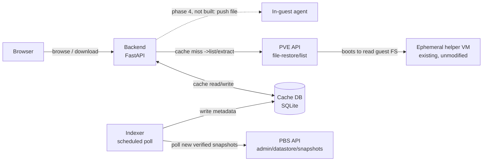

# Restore Timeline — implementation plan

A companion web app for Proxmox VE + Proxmox Backup Server: a scrubbable
snapshot timeline and file browser for file-level restore, in the spirit
of Synology Active Backup for Business's restore portal. Proxmox's own
file-restore feature already does the hard part — safely reading an
arbitrary guest filesystem out of a backup via a throwaway helper VM —
it's just missing a way to scrub across snapshots instead of picking one
at a time from a flat list. This adds that on top of Proxmox's existing
API, without modifying Proxmox itself.

## 1. Why

Every backup in Proxmox VE's GUI is a separate, flat list entry. To
compare a file across two points in time you back out, pick a different
snapshot, and re-navigate to the same folder by hand. Active Backup for
Business's restore portal has the piece Proxmox lacks: a horizontal
timeline along the bottom, one dot per recovery point, that you drag or
click to scrub through history while the file listing above updates in
place. That scrubber — and the small service behind it — is what this
project builds.

## 2. Scope & the decisions already made

This ships as a **separate companion app**, not a patch to the Proxmox
web UI — Proxmox's GUI has no plugin system, so there's no clean seam to
inject a new panel into the existing Backups tab.

On feature parity with ABB: **build browse-and-download first, matched
closely to the ABB layout. Treat "restore directly into the original,
running VM" as a distinct later phase (phase 4) with its own design.**
ABB can write a restored file straight back onto the source machine
because Synology already runs its own agent inside that machine.
Proxmox's file-restore API stops one step earlier — it hands you bytes,
full stop. Getting those bytes back into a *live* guest's filesystem
needs something Proxmox doesn't ship: a small listener running inside
each guest OS. That's a separate project (its own auth, a Windows
service *and* a Linux daemon since guests here are mixed OSes) and
belongs in phase 4, not the MVP.

## 3. Phase 0 recon findings — CONFIRMED

Captured from the real Proxmox VE GUI (browser devtools, network tab)
on 2026-08-29. This replaces guesswork with an observed contract.

**Endpoint:** the call goes through **PVE's own API**, not PBS's admin
API directly:

```
GET https://<pve-host>:8006/api2/json/nodes/localhost/storage/<storage-id>/file-restore/list
    ?volume=<storage-id>:backup/<type>/<vmid>/<snapshot-timestamp>
    &filepath=<path>
```

Observed real example (root listing):
```
GET /api2/json/nodes/localhost/storage/pbs/file-restore/list
    ?volume=pbs:backup/vm/132/2026-08-29T14:48:06Z
    &filepath=/
```

Observed real example (drilling into a disk):
```
GET /api2/json/nodes/localhost/storage/pbs/file-restore/list
    ?volume=pbs:backup/vm/132/2026-08-29T14:48:06Z
    &filepath=L2RyaXZlLXNjc2kwLmltZy5maWR4
```
`L2RyaXZlLXNjc2kwLmltZy5maWR4` base64-decodes to `/drive-scsi0.img.fidx`.

**Confirmed quirks worth remembering:**
- The **node segment is literally the string `localhost`**, not the
  real hostname — PVE resolves it to whichever node the request lands
  on. Our backend can always use `localhost` here.
- `filepath=/` for the root is passed as a **literal, unencoded `/`**
  (URL-encoded by the browser to `%2F`). Any path *deeper* than root is
  **base64-encoded** first, then URL-encoded. Don't assume one encoding
  scheme for both cases.
- `volume` is the familiar PVE volid shape:
  `<storage-id>:backup/<vm|ct>/<vmid>/<ISO8601 backup timestamp, Z-suffixed>`.
- Auth on this request used the GUI's normal session ticket
  (`PVEAuthCookie` cookie) plus a `CSRFPreventionToken` header — **not**
  yet confirmed to work with a scoped API token. This is the next thing
  to verify before phase 1 starts: whether `file-restore/list` accepts
  `Authorization: PVEAPIToken=user@realm!token=secret`, or requires a
  real ticket. Some Proxmox endpoints that proxy to internal helper
  daemons have historically been picky about this.
- **Timing confirms the cold-lookup risk directly:** the root listing
  returned in 84ms; drilling one level into the actual disk image took
  **3.08s** — that's the helper VM booting to read the filesystem. Any
  UI built on this needs an honest loading state for that gap, and the
  caching plan below is not optional polish, it's load-bearing.

**Phase 0 — CLOSED, 2026-08-29.** The two remaining open items were
resolved by consulting Proxmox's own published API schema (the data
file behind `https://pve.proxmox.com/pve-docs/api-viewer/`, not just
the human-readable page — it ships the full machine-readable spec for
every endpoint, including the internal ones used by the GUI):

- **API-token auth is officially supported.** Both
  `file-restore/list` and `file-restore/download` are marked
  `"allowtoken": 1` in the schema. No session-ticket fallback needed —
  the backend can hold a single scoped `PVEAPIToken=user@realm!token=secret`
  and use it for every call.
- **Permissions are minimal.** Both endpoints require only
  `"You need read access for the volume."` (`"user": "all"` — any
  authenticated principal with read access to that volume, no special
  admin role). This confirms a narrowly-scoped token is sufficient, no
  elevated privileges needed on the PVE side.
- **`file-restore/download` contract, from the schema:**
  ```
  GET /api2/json/nodes/{node}/storage/{storage}/file-restore/download
      ?volume=<volid>
      &filepath=<base64-path-or-/>
      &tar=<0|1>            (optional, default 0)
  ```
  - `tar=1` downloads a directory as `tar.zst` instead of the default
    `zip`.
  - `returns: {"type": "any"}` — a raw byte stream, not JSON. This
    also explains why clicking Download in the GUI didn't show up as
    an XHR/fetch entry during manual traffic capture: it's most likely
    a direct browser navigation to the URL (`window.location` or an
    `<a>` click) rather than an ajax call, so it wouldn't appear under
    a Fetch/XHR devtools filter. No further capture needed — the
    schema is authoritative and matches the confirmed `list` shape
    (same `volume`/`filepath` encoding).
- **`file-restore/list` response schema, from the same source:**
  array of objects: `{filepath: string (base64), leaf: boolean,
  mtime?: integer (unix ts), size?: integer, text: string, type:
  string}`. This matches the request/latency behavior already
  captured empirically above.
- **Confirmed quirk (2026-08-29, real usage):** navigability is
  governed by **`leaf`**, not `type`. At the root listing, a virtual
  disk (e.g. `drive-scsi0.img.fidx`) has `type: "f"` but `leaf: false`
  — it looks like a file but is actually drillable, and drilling into
  it is how you reach the guest's real filesystem. Any UI must branch
  on `leaf`, not on `type == "d"`, to decide whether an entry is
  clickable/browsable. Getting this backwards makes the root disk
  entry look like a terminal file, which also leads users to try
  downloading the raw disk blob directly (returns an empty/degenerate
  response — that endpoint isn't meant for that).

No live response-body capture was ultimately needed — the published
schema is authoritative for shape, and the empirical capture already
locked down timing and encoding quirks the schema doesn't document.

**Scoped token setup.** (Note: the currently-deployed service accounts
predate the project rename to pve-flr-portal and are still named
`pve-backup-portal@titan` / `pve-backup-portal@pbs` on the real PVE/PBS
servers — the `pve-flr-portal@...` names below are the convention for
new setups, not a claim that the live accounts were renamed.)
`PVE::Storage::check_volume_access` (pve-storage
source) requires, for a `backup`-type volume, *both*
`Datastore.AllocateSpace` on `/storage/{storage}` *and* `VM.Backup` on
`/vms/{vmid}` — `Datastore.Audit` alone is not sufficient for this
content type. Commands to create the scoped PVE token (run on the PVE
node):

```
pveum role add FileRestoreReader -privs "Datastore.AllocateSpace,VM.Backup"
pveum user add pve-flr-portal@pve --comment "pve-flr-portal service account"
pveum user token add pve-flr-portal@pve portal --privsep=1
pveum acl modify /storage/<storage-id> --tokens 'pve-flr-portal@pve!portal' --roles FileRestoreReader
pveum acl modify /vms/<vmid> --tokens 'pve-flr-portal@pve!portal' --roles FileRestoreReader
```

And the PBS-side token (`DatastoreReader`, built-in role) used only for
snapshot enumeration (run on the PBS node):

```
proxmox-backup-manager user create pve-flr-portal@pbs --comment "pve-flr-portal service account"
proxmox-backup-manager user generate-token pve-flr-portal@pbs portal
proxmox-backup-manager acl update /datastore/<datastore-name> DatastoreReader --auth-id 'pve-flr-portal@pbs!portal'
```

Both `... token add`/`... generate-token` commands print the token
secret exactly once — copy it straight into `.env`, never into chat or
version control. When PH.3 adds more guests, repeat the two `pveum acl
modify` lines for each additional `/vms/{vmid}`.

**PBS-specific gotcha confirmed 2026-08-29:** unlike PVE tokens, a PBS
API token's effective permissions are the **intersection** of the
token's own ACL entries and the underlying user's own ACL entries — the
user acts as a ceiling, never a source. Granting the role only to the
token's auth-id (`pve-flr-portal@pbs!portal`) and not to the plain
user (`pve-flr-portal@pbs`) resulted in an empty effective
permission set and a 403 on `admin/datastore/{store}/snapshots`, even
though `acl list` showed the token's grant present. Fix: run the same
`acl update ... --auth-id` command a second time against the bare
userid (no `!token`). Confirm with `proxmox-backup-manager user
permissions '<user>@pbs!<token>' --path /datastore/<store>` — it must
show `Datastore.Audit`/`Datastore.Read` before the API call will work.

**Same gotcha on the PVE side, confirmed 2026-08-29.** With the default
`--privsep=1`, a PVE API token's effective permissions are also
intersected with the underlying user's own ACLs (not just the token's).
Granting `FileRestoreReader` only via `--tokens
'pve-flr-portal@pve!portal'` produced `403 Permission check failed
(/storage/pbs, Datastore.AllocateSpace)` on `file-restore/list`, even
though the token's own ACL entry was correctly in place. Fix: run the
same `pveum acl modify` commands a second time against the bare user
with `--users pve-flr-portal@pve` instead of `--tokens ...`. Net
result: **both the token and its owning user need the ACL grant** on
`/storage/<storage-id>` and `/vms/<vmid>`, on both PVE and PBS.

**Tearing down the service-account credentials (do this when PH.4
lands).** PH.1–PH.3 authenticate as one shared service account on each
side. Once PH.4 replaces that with per-user login, remove the service
accounts entirely rather than leaving unused standing credentials
around. On PVE:

```
pveum acl delete /storage/<storage-id> --users pve-flr-portal@pve --roles FileRestoreReader
pveum acl delete /storage/<storage-id> --tokens 'pve-flr-portal@pve!portal' --roles FileRestoreReader
pveum acl delete /vms/<vmid> --users pve-flr-portal@pve --roles FileRestoreReader
pveum acl delete /vms/<vmid> --tokens 'pve-flr-portal@pve!portal' --roles FileRestoreReader
pveum user token remove pve-flr-portal@pve portal
pveum user delete pve-flr-portal@pve
pveum role delete FileRestoreReader   # only if nothing else uses it
```

On PBS:

```
proxmox-backup-manager user delete-token pve-flr-portal@pbs portal
proxmox-backup-manager user remove pve-flr-portal@pbs
```

The PBS ACL entry for the token/user is removed implicitly when the
user is deleted; if it needs removing while the user still exists, the
same `acl update` form used to add it should have a removal flag —
check `proxmox-backup-manager acl update --help` at the time, since
this wasn't verified against a real removal in this session (only
additions were exercised). Also remove the corresponding
`PVE_TOKEN_*`/`PBS_TOKEN_*` values from `.env` once the new per-user
auth path is live.

## 4. Architecture

Nothing here modifies Proxmox. The new pieces are an indexer, a small
backend that owns one scoped credential, a local cache, and the
browser-facing UI.



Note the split confirmed in §3: **listing/reading files** inside a
snapshot goes through the **PVE** API (`file-restore/list`), while
**enumerating which snapshots exist** for a guest is a **PBS**-side
datastore operation. The indexer talks to PBS; the live browse/download
path talks to PVE. Two different servers, two different credentials to
scope.

### Why an indexer and a cache, specifically

The timeline only feels like ABB's if dragging across it is instant.
Per §3, an uncached directory listing costs a multi-second round trip
through the helper VM. Scrub across ten snapshots without caching and
you're waiting ten times. So the indexer's job is narrow: poll PBS for
newly verified snapshots and record just their metadata (timestamp,
size, verified flag) — it does **not** eagerly walk every file in every
snapshot. Directory listings are cached lazily, the first time someone
actually opens that folder at that point in time.

## 5. UI mapping — ABB screenshot → this build

| ABB element | What it does | Our build | Fidelity |
|---|---|---|---|
| Left tree — Disk 1 – Volume 1/3/4 | Pick which virtual disk/partition to browse | `file-restore/list` at root returns the disks; rendered as a left nav tree | Full — this is literally what the confirmed API returns |
| File grid — Name / Size / Type / Modified time | Standard sortable file listing | Same four columns, sortable client-side once a directory's listing is cached | Full |
| Restore / Download buttons | Restore writes back to source; Download saves locally | Download works from phase 1. Restore stays visibly disabled ("Restore to guest — planned") until phase 4 | Partial by design |
| Filter box | Narrows the current folder's listing | Client-side filter over the cached listing | Full |
| Bottom timeline — dots, count badges, draggable date marker, zoom | Scrub across backup dates, jump to one | Hand-rolled: one dot per indexed snapshot, badge per day at current zoom, click sets active snapshot and re-renders the grid | The reason the project exists — most build effort here |
| Calendar-jump / locate icons | Jump to a date, or re-center on "now" | Same two icons wired to the timeline component | Full, once the timeline exists |

### PH.2 implementation status (2026-08-29)

The timeline widget (hand-rolled inline SVG, `backend/static/app.js`
`renderTimeline()`) is built and working: per-day dots with drop
shadow, a speech-bubble count badge above each (always shown, even for
count=1), a day-picker popup (numbered rows, styled after the real
`.syno-ab-timeline-menu` CSS) that opens on any marker click, an
icon toolbar (calendar date-picker, "now", jump-to-latest-snapshot,
refresh, older/newer-snapshot stepper) matching the real ABB icon
positions, drag-to-pan via Pointer Events, and a fixed center reference
line (not tied to any date — selecting a snapshot pans the view so its
day lands under it). Colors/fonts are pulled from ABB's real shipped
CSS (`ActiveBackup-Portal/style.css`, captured via the user's own
DevTools, not guessed): navy `#16415C` top bar, `#007CB2` accent,
`#2C8BC7` selected-marker blue, Open Sans.

A dev-only synthetic-data test harness lives at
`backend/static/timeline-preview.html` — generates ~90 days of fake
snapshots (with periodic multi-per-day clusters) so the timeline can be
exercised without real backup history. Its markup must be kept in sync
by hand with `index.html`'s timeline `<footer>` block; there's a
comment in both files calling this out.

**Confirmed quirk (2026-08-29): `Element.setPointerCapture()` silently
kills click targeting on descendant shapes.** The drag-to-pan handler
originally called `svg.setPointerCapture(e.pointerId)` on `pointerdown`
to keep panning working if the cursor left the widget mid-drag. This
retargets *every* subsequent event for that pointer — including
`pointerup` and the browser's synthesized `click` — to the capturing
element itself. Result: every click inside the SVG resolved its
`event.target` to the bare `<svg>` root, never to the marker `<g>` or
any child shape, regardless of hit-area size, z-order, or fill opacity.
Identical in Firefox and Chrome/Edge (both implement the same
click-follows-capture behavior per spec), which is what made it so
confusing to chase — it looked like a hit-testing/sizing bug but was
actually an event-retargeting one. Fix: don't call
`setPointerCapture` — attach `pointermove`/`pointerup`/`pointercancel`
to `window` for the drag's duration instead (same "keep panning past
the widget edge" behavior, no retargeting side effect). Verified via a
live A/B in DevTools: re-adding `setPointerCapture` at runtime
reproduced the exact bug instantly at an identical click coordinate.
If marker clicks ever go dead again, check here first before
suspecting hit-area geometry.

**Tooling note:** when driving a real browser via automation to debug
click coordinates, the screenshot/click coordinate space can be scaled
down from the actual CSS pixel viewport (observed here: screenshots
~1500px wide vs. `window.innerWidth` of 2089) — always scale computed
`getBoundingClientRect()` coordinates by the same ratio before clicking
with the automation tool, or clicks silently land on the wrong element.

## 6. Data model

```sql
CREATE TABLE snapshots (
  id            INTEGER PRIMARY KEY,
  guest         TEXT NOT NULL,        -- e.g. 'dc2.ad.starrise.net' or vmid 132
  volume        TEXT NOT NULL,        -- full volid, e.g. 'pbs:backup/vm/132/2026-08-29T14:48:06Z'
  backup_time   TEXT NOT NULL,        -- ISO 8601, from PBS
  verified      BOOLEAN,
  size_bytes    INTEGER,
  UNIQUE(guest, backup_time)
);

CREATE TABLE dir_cache (
  snapshot_id   INTEGER REFERENCES snapshots(id),
  path          TEXT NOT NULL,        -- decoded path, e.g. '/' or '/drive-scsi0.img.fidx'
  listing_json  TEXT NOT NULL,        -- cached file-restore/list response
  fetched_at    TEXT NOT NULL,
  PRIMARY KEY (snapshot_id, path)
);
```

The timeline widget only ever queries `snapshots`, grouped by day at
whatever zoom level is active — that's what makes the scrub itself
instant regardless of whether a given folder has been opened yet.

## 7. Phased roadmap

| Phase | Goal | Key work | Est. effort |
|---|---|---|---|
| PH.0 | Recon | **Mostly done, see §3.** Remaining: confirm token auth, capture the download/extract call and a real response body. | 0.5–1 day total (partial) |
| PH.1 | MVP browse & download | Backend calling the real `file-restore/list` for one hardcoded guest/volume. Flat snapshot list (no timeline yet), file grid, download. | 3–5 days |
| PH.2 | Timeline UI | Replace the flat list with the scrubber: dots per snapshot, count badges when zoomed out, click-to-select updates the grid in place. | 3–4 days |
| PH.3 | Caching, multi-guest, polish | Indexer job against PBS, directory-listing cache, more than one guest, filter box, loading state for cold (cache-miss) lookups. | 2–3 days |
| PH.4 | Per-user auth | Replace the single shared service token with per-user login against PVE/PBS, so the portal reflects each logged-in user's own permissions instead of one admin-scoped credential. See note below — added 2026-08-29, deliberately sequenced after PH.3 rather than blocking it. | TBD, needs its own design pass |
| PH.5 | Push-to-guest *(stretch)* | Design + build a minimal in-guest agent (Windows service for `dc2.ad.starrise.net`, Linux daemon for the rest) the backend can hand a file to for placement, with its own auth. Separate, open-ended scope. | 1–2+ weeks |

**On PH.4 (per-user auth):** the plan as built through PH.3 assumes a
single shared, narrowly-scoped service token held server-side (see
Hard constraints in CLAUDE.md) — there is no per-user login at all.
The user has asked for the portal to eventually support logging in
with one's own PVE/PBS identity and reflecting that identity's actual
permissions, rather than everyone sharing the portal's one service
account. This is a real architecture change (session handling,
delegating to the logged-in user's credentials per-request instead of
one static token, mapping PVE/PBS roles to what the UI shows) and
deliberately was *not* pulled forward — PH.1–PH.3 continue to target
the single-token model so browse/download/timeline can be finished
against a simple, known-working auth story first. Revisit this phase's
design once PH.3 is done.

## 8. Stack — and why

- **Backend:** Python, FastAPI — one small process, typed surface for a
  handful of endpoints (list snapshots, list a path, download, later
  push-to-guest).
- **Storage:** SQLite — a metadata cache, not a system of record; the
  real data of record stays in PBS.
- **Frontend:** server-rendered HTML + htmx + Alpine.js — the timeline
  is a few dozen DOM nodes reacting to small JSON payloads; this needs
  no build pipeline, no `node_modules`, no bundler to keep patched.
- **Timeline widget:** hand-rolled inline SVG — no charting library
  reaches for "date axis, one dot per discrete event, drag to scrub,
  zoom."

This is a tool one person maintains occasionally alongside an already
full plate of homelab admin — optimize for low ongoing maintenance over
architectural purity.

## 9. Risks & unknowns

- **Undocumented API.** `file-restore/list` isn't in Proxmox's published
  API reference — it's internal to the GUI (confirmed in §3). It could
  shift shape across a PVE upgrade with no changelog pointing at it.
  Mitigation: pin against a known-good PVE version, re-run recon after
  any upgrade.
- **Cold-lookup latency.** Confirmed empirically at 3.08s for one
  uncached directory (§3). Inherent to how file-restore works. The UI
  needs an honest loading state, not a pretense of instant response.
- **Filesystem coverage.** file-restore only understands common
  filesystems (ext4, XFS, NTFS, FAT and similar). An exotic layout may
  simply not browse.
- **Credential handling.** The backend needs read access to two
  different servers: a PVE API token (confirmed sufficient in §3, no
  session ticket needed) for file-restore, and a separate PBS API
  token scoped to `DatastoreReader` on the specific datastore for
  snapshot listing. Both stay server-side only, never sent to the
  browser.

## 10. Next step

**Phase 0 is closed as of 2026-08-29** — see §3. Auth is a single
scoped PVE API token; both `file-restore/list` and `file-restore/download`
are confirmed to accept it. Phase 1 (backend calling the real
`file-restore/list`/`download` for one hardcoded guest/volume, flat
snapshot list, file grid, download) starts now.
