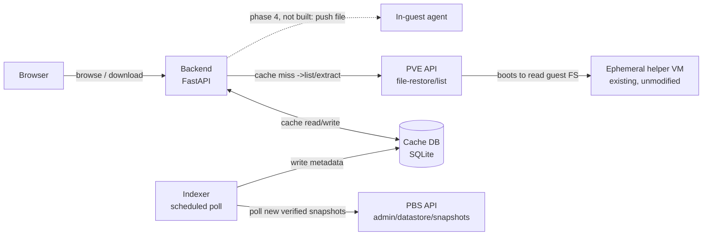

# Restore Timeline — implementation plan

A companion web app for Proxmox VE + Proxmox Backup Server: a scrubbable
snapshot timeline and file browser for file-level restore, in the spirit
of Synology Active Backup for Business's restore portal. Proxmox's own
file-restore feature already does the hard part — safely reading an
arbitrary guest filesystem out of a backup via a throwaway helper VM —
it's just missing a way to scrub across snapshots instead of picking one
at a time from a flat list. This adds that on top of Proxmox's existing
API, without modifying Proxmox itself.

## 1. Why

Every backup in Proxmox VE's GUI is a separate, flat list entry. To
compare a file across two points in time you back out, pick a different
snapshot, and re-navigate to the same folder by hand. Active Backup for
Business's restore portal has the piece Proxmox lacks: a horizontal
timeline along the bottom, one dot per recovery point, that you drag or
click to scrub through history while the file listing above updates in
place. That scrubber — and the small service behind it — is what this
project builds.

## 2. Scope & the decisions already made

This ships as a **separate companion app**, not a patch to the Proxmox
web UI — Proxmox's GUI has no plugin system, so there's no clean seam to
inject a new panel into the existing Backups tab.

On feature parity with ABB: **build browse-and-download first, matched
closely to the ABB layout. Treat "restore directly into the original,
running VM" as a distinct later phase (phase 4) with its own design.**
ABB can write a restored file straight back onto the source machine
because Synology already runs its own agent inside that machine.
Proxmox's file-restore API stops one step earlier — it hands you bytes,
full stop. Getting those bytes back into a *live* guest's filesystem
needs something Proxmox doesn't ship: a small listener running inside
each guest OS. That's a separate project (its own auth, a Windows
service *and* a Linux daemon since guests here are mixed OSes) and
belongs in phase 4, not the MVP.

## 3. Phase 0 recon findings — CONFIRMED

Captured from the real Proxmox VE GUI (browser devtools, network tab)
on 2026-08-29. This replaces guesswork with an observed contract.

**Endpoint:** the call goes through **PVE's own API**, not PBS's admin
API directly:

```
GET https://<pve-host>:8006/api2/json/nodes/localhost/storage/<storage-id>/file-restore/list
    ?volume=<storage-id>:backup/<type>/<vmid>/<snapshot-timestamp>
    &filepath=<path>
```

Observed real example (root listing):
```
GET /api2/json/nodes/localhost/storage/pbs/file-restore/list
    ?volume=pbs:backup/vm/132/2026-08-29T14:48:06Z
    &filepath=/
```

Observed real example (drilling into a disk):
```
GET /api2/json/nodes/localhost/storage/pbs/file-restore/list
    ?volume=pbs:backup/vm/132/2026-08-29T14:48:06Z
    &filepath=L2RyaXZlLXNjc2kwLmltZy5maWR4
```
`L2RyaXZlLXNjc2kwLmltZy5maWR4` base64-decodes to `/drive-scsi0.img.fidx`.

**Confirmed quirks worth remembering:**
- The **node segment is literally the string `localhost`**, not the
  real hostname — PVE resolves it to whichever node the request lands
  on. Our backend can always use `localhost` here.
- `filepath=/` for the root is passed as a **literal, unencoded `/`**
  (URL-encoded by the browser to `%2F`). Any path *deeper* than root is
  **base64-encoded** first, then URL-encoded. Don't assume one encoding
  scheme for both cases.
- `volume` is the familiar PVE volid shape:
  `<storage-id>:backup/<vm|ct>/<vmid>/<ISO8601 backup timestamp, Z-suffixed>`.
- Auth on this request used the GUI's normal session ticket
  (`PVEAuthCookie` cookie) plus a `CSRFPreventionToken` header — **not**
  yet confirmed to work with a scoped API token. This is the next thing
  to verify before phase 1 starts: whether `file-restore/list` accepts
  `Authorization: PVEAPIToken=user@realm!token=secret`, or requires a
  real ticket. Some Proxmox endpoints that proxy to internal helper
  daemons have historically been picky about this.
- **Timing confirms the cold-lookup risk directly:** the root listing
  returned in 84ms; drilling one level into the actual disk image took
  **3.08s** — that's the helper VM booting to read the filesystem. Any
  UI built on this needs an honest loading state for that gap, and the
  caching plan below is not optional polish, it's load-bearing.

**Still open before phase 1 can start with full confidence:**
- Confirm API-token auth works for this endpoint (or fall back to a
  ticket the backend logs in and refreshes itself).
- Capture the equivalent `file-restore/download` (or extract) call the
  GUI makes when you click Download, and the shape of a folder-as-zip
  response.
- Capture one response body (not just headers) for both the root list
  and a deeper list, to lock down the JSON schema (`resources`/`tasks`
  requests seen alongside these look like unrelated GUI chrome —
  confirm they're not part of the contract).

## 4. Architecture

Nothing here modifies Proxmox. The new pieces are an indexer, a small
backend that owns one scoped credential, a local cache, and the
browser-facing UI.



Note the split confirmed in §3: **listing/reading files** inside a
snapshot goes through the **PVE** API (`file-restore/list`), while
**enumerating which snapshots exist** for a guest is a **PBS**-side
datastore operation. The indexer talks to PBS; the live browse/download
path talks to PVE. Two different servers, two different credentials to
scope.

### Why an indexer and a cache, specifically

The timeline only feels like ABB's if dragging across it is instant.
Per §3, an uncached directory listing costs a multi-second round trip
through the helper VM. Scrub across ten snapshots without caching and
you're waiting ten times. So the indexer's job is narrow: poll PBS for
newly verified snapshots and record just their metadata (timestamp,
size, verified flag) — it does **not** eagerly walk every file in every
snapshot. Directory listings are cached lazily, the first time someone
actually opens that folder at that point in time.

## 5. UI mapping — ABB screenshot → this build

| ABB element | What it does | Our build | Fidelity |
|---|---|---|---|
| Left tree — Disk 1 – Volume 1/3/4 | Pick which virtual disk/partition to browse | `file-restore/list` at root returns the disks; rendered as a left nav tree | Full — this is literally what the confirmed API returns |
| File grid — Name / Size / Type / Modified time | Standard sortable file listing | Same four columns, sortable client-side once a directory's listing is cached | Full |
| Restore / Download buttons | Restore writes back to source; Download saves locally | Download works from phase 1. Restore stays visibly disabled ("Restore to guest — planned") until phase 4 | Partial by design |
| Filter box | Narrows the current folder's listing | Client-side filter over the cached listing | Full |
| Bottom timeline — dots, count badges, draggable date marker, zoom | Scrub across backup dates, jump to one | Hand-rolled: one dot per indexed snapshot, badge per day at current zoom, click sets active snapshot and re-renders the grid | The reason the project exists — most build effort here |
| Calendar-jump / locate icons | Jump to a date, or re-center on "now" | Same two icons wired to the timeline component | Full, once the timeline exists |

## 6. Data model

```sql
CREATE TABLE snapshots (
  id            INTEGER PRIMARY KEY,
  guest         TEXT NOT NULL,        -- e.g. 'dc2.ad.starrise.net' or vmid 132
  volume        TEXT NOT NULL,        -- full volid, e.g. 'pbs:backup/vm/132/2026-08-29T14:48:06Z'
  backup_time   TEXT NOT NULL,        -- ISO 8601, from PBS
  verified      BOOLEAN,
  size_bytes    INTEGER,
  UNIQUE(guest, backup_time)
);

CREATE TABLE dir_cache (
  snapshot_id   INTEGER REFERENCES snapshots(id),
  path          TEXT NOT NULL,        -- decoded path, e.g. '/' or '/drive-scsi0.img.fidx'
  listing_json  TEXT NOT NULL,        -- cached file-restore/list response
  fetched_at    TEXT NOT NULL,
  PRIMARY KEY (snapshot_id, path)
);
```

The timeline widget only ever queries `snapshots`, grouped by day at
whatever zoom level is active — that's what makes the scrub itself
instant regardless of whether a given folder has been opened yet.

## 7. Phased roadmap

| Phase | Goal | Key work | Est. effort |
|---|---|---|---|
| PH.0 | Recon | **Mostly done, see §3.** Remaining: confirm token auth, capture the download/extract call and a real response body. | 0.5–1 day total (partial) |
| PH.1 | MVP browse & download | Backend calling the real `file-restore/list` for one hardcoded guest/volume. Flat snapshot list (no timeline yet), file grid, download. | 3–5 days |
| PH.2 | Timeline UI | Replace the flat list with the scrubber: dots per snapshot, count badges when zoomed out, click-to-select updates the grid in place. | 3–4 days |
| PH.3 | Caching, multi-guest, polish | Indexer job against PBS, directory-listing cache, more than one guest, filter box, loading state for cold (cache-miss) lookups. | 2–3 days |
| PH.4 | Push-to-guest *(stretch)* | Design + build a minimal in-guest agent (Windows service for `dc2.ad.starrise.net`, Linux daemon for the rest) the backend can hand a file to for placement, with its own auth. Separate, open-ended scope. | 1–2+ weeks |

## 8. Stack — and why

- **Backend:** Python, FastAPI — one small process, typed surface for a
  handful of endpoints (list snapshots, list a path, download, later
  push-to-guest).
- **Storage:** SQLite — a metadata cache, not a system of record; the
  real data of record stays in PBS.
- **Frontend:** server-rendered HTML + htmx + Alpine.js — the timeline
  is a few dozen DOM nodes reacting to small JSON payloads; this needs
  no build pipeline, no `node_modules`, no bundler to keep patched.
- **Timeline widget:** hand-rolled inline SVG — no charting library
  reaches for "date axis, one dot per discrete event, drag to scrub,
  zoom."

This is a tool one person maintains occasionally alongside an already
full plate of homelab admin — optimize for low ongoing maintenance over
architectural purity.

## 9. Risks & unknowns

- **Undocumented API.** `file-restore/list` isn't in Proxmox's published
  API reference — it's internal to the GUI (confirmed in §3). It could
  shift shape across a PVE upgrade with no changelog pointing at it.
  Mitigation: pin against a known-good PVE version, re-run recon after
  any upgrade.
- **Cold-lookup latency.** Confirmed empirically at 3.08s for one
  uncached directory (§3). Inherent to how file-restore works. The UI
  needs an honest loading state, not a pretense of instant response.
- **Filesystem coverage.** file-restore only understands common
  filesystems (ext4, XFS, NTFS, FAT and similar). An exotic layout may
  simply not browse.
- **Credential handling.** The backend needs read access to two
  different servers (PVE for file-restore, PBS for snapshot listing).
  Whichever form each takes (API token vs. session ticket — see the
  open question in §3), it stays server-side only and is scoped as
  narrowly as each API allows. Never sent to the browser.

## 10. Next step

Confirm token-based auth against `file-restore/list` (or decide to have
the backend hold and refresh a PVE ticket instead), then capture the
Download button's real network call the same way §3's listing calls
were captured. Once both are in hand, phase 1 can start against a
confirmed contract instead of an assumed one.
