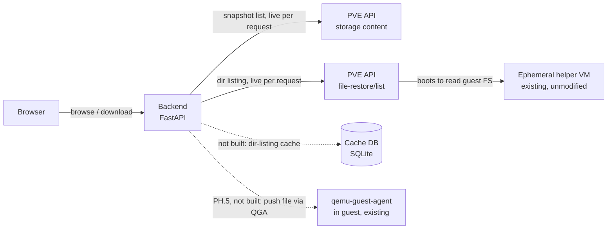

# Restore Timeline — implementation plan

This is the **living** architecture/reference doc — current design
decisions and how the system works today. For open work, see
[`TODO.md`](../TODO.md); for what shipped in each release, see
[`CHANGELOG.md`](../CHANGELOG.md); for the phase-by-phase development
history (including debugging war stories worth knowing before touching
the timeline code), see
[`docs/archive/plan-phases-0-4.md`](archive/plan-phases-0-4.md).

A companion web app for Proxmox VE + Proxmox Backup Server: a scrubbable
snapshot timeline and file browser for file-level restore, in the spirit
of Synology Active Backup for Business's restore portal. Proxmox's own
file-restore feature already does the hard part — safely reading an
arbitrary guest filesystem out of a backup via a throwaway helper VM —
it's just missing a way to scrub across snapshots instead of picking one
at a time from a flat list. This adds that on top of Proxmox's existing
API, without modifying Proxmox itself.

## 1. Why

Every backup in Proxmox VE's GUI is a separate, flat list entry. To
compare a file across two points in time you back out, pick a different
snapshot, and re-navigate to the same folder by hand. Active Backup for
Business's restore portal has the piece Proxmox lacks: a horizontal
timeline along the bottom, one dot per recovery point, that you drag or
click to scrub through history while the file listing above updates in
place. That scrubber — and the small service behind it — is what this
project builds.

## 2. Scope & the decisions already made

This ships as a **separate companion app**, not a patch to the Proxmox
web UI — Proxmox's GUI has no plugin system, so there's no clean seam to
inject a new panel into the existing Backups tab.

**Proxmox Backup Server is a hard requirement.** The whole app is built
on Proxmox's "File Restore" feature (`file-restore/list` / `download`,
§3), and per Proxmox's own docs that feature *"is only available for
backups on a Proxmox Backup Server."* Plain `vzdump` backups on
directory / NFS / CIFS storage cannot be browsed file-by-file through
any API — recovering a file from those is a manual `vma extract` +
loop-mount on the CLI, which this app does not and cannot wrap. If a
site has no PBS, this tool has nothing to show. (Secondary point: PBS
also keeps many retained recovery points per guest cheaply via dedup,
which is what makes a *timeline* worth scrubbing; a handful of rotated
vzdump files would barely fill one.)

On feature parity with ABB: **build browse-and-download first, matched
closely to the ABB layout. Treat "restore directly into the original,
running VM" as a distinct later phase (PH.5) with its own design.**
ABB can write a restored file straight back onto the source machine by
connecting to it through **VMware Guest Tools** (already installed for
normal VM management) and authenticating **as a guest OS user** with
credentials the operator supplies to the restore tool — it is not a
Synology-specific agent. Proxmox's file-restore API stops one step
earlier: it hands you bytes, full stop. Getting those bytes back into a
*live* guest's filesystem needs an in-guest channel — and Proxmox
already ships the equivalent of VMware Guest Tools: **`qemu-guest-agent`
(QGA)**, the same agent the backup path uses for fs-freeze. QGA can
write files and run commands in the guest, as root/SYSTEM, with **no
guest credentials required** — the authorization is a per-user PVE
privilege (`VM.GuestAgent.*`), not a guest password. So PH.5 does *not*
need a bespoke listener daemon; it needs a careful design on top of QGA.
See `TODO.md` for the mechanism, limits, and scope. It still belongs in
PH.5, not the MVP.

## 3. Phase 0 recon findings — CONFIRMED

Captured from the real Proxmox VE GUI (browser devtools, network tab)
on 2026-08-29. This replaces guesswork with an observed contract.

**Endpoint:** the call goes through **PVE's own API**, not PBS's admin
API directly:

```
GET https://<pve-host>:8006/api2/json/nodes/localhost/storage/<storage-id>/file-restore/list
    ?volume=<storage-id>:backup/<type>/<vmid>/<snapshot-timestamp>
    &filepath=<path>
```

Observed real example (root listing):
```
GET /api2/json/nodes/localhost/storage/pbs/file-restore/list
    ?volume=pbs:backup/vm/132/2026-08-29T14:48:06Z
    &filepath=/
```

Observed real example (drilling into a disk):
```
GET /api2/json/nodes/localhost/storage/pbs/file-restore/list
    ?volume=pbs:backup/vm/132/2026-08-29T14:48:06Z
    &filepath=L2RyaXZlLXNjc2kwLmltZy5maWR4
```
`L2RyaXZlLXNjc2kwLmltZy5maWR4` base64-decodes to `/drive-scsi0.img.fidx`.

**Confirmed quirks worth remembering:**
- The **node segment is literally the string `localhost`**, not the
  real hostname — PVE resolves it to whichever node the request lands
  on. Our backend can always use `localhost` here.
- `filepath=/` for the root is passed as a **literal, unencoded `/`**
  (URL-encoded by the browser to `%2F`). Any path *deeper* than root is
  **base64-encoded** first, then URL-encoded. Don't assume one encoding
  scheme for both cases.
- `volume` is the familiar PVE volid shape:
  `<storage-id>:backup/<vm|ct>/<vmid>/<ISO8601 backup timestamp, Z-suffixed>`.
- Auth on this request used the GUI's normal session ticket
  (`PVEAuthCookie` cookie) plus a `CSRFPreventionToken` header — **not**
  yet confirmed to work with a scoped API token. This is the next thing
  to verify before phase 1 starts: whether `file-restore/list` accepts
  `Authorization: PVEAPIToken=user@realm!token=secret`, or requires a
  real ticket. Some Proxmox endpoints that proxy to internal helper
  daemons have historically been picky about this.
- **Timing confirms the cold-lookup risk directly:** the root listing
  returned in 84ms; drilling one level into the actual disk image took
  **3.08s** — that's the helper VM booting to read the filesystem. Any
  UI built on this needs an honest loading state for that gap, and the
  caching plan below is not optional polish, it's load-bearing.

**Phase 0 — CLOSED, 2026-08-29.** The two remaining open items were
resolved by consulting Proxmox's own published API schema (the data
file behind `https://pve.proxmox.com/pve-docs/api-viewer/`, not just
the human-readable page — it ships the full machine-readable spec for
every endpoint, including the internal ones used by the GUI):

- **API-token auth is officially supported.** Both
  `file-restore/list` and `file-restore/download` are marked
  `"allowtoken": 1` in the schema. No session-ticket fallback needed —
  the backend can hold a single scoped `PVEAPIToken=user@realm!token=secret`
  and use it for every call.
- **Permissions are minimal.** Both endpoints require only
  `"You need read access for the volume."` (`"user": "all"` — any
  authenticated principal with read access to that volume, no special
  admin role). This confirms a narrowly-scoped token is sufficient, no
  elevated privileges needed on the PVE side.
- **`file-restore/download` contract, from the schema:**
  ```
  GET /api2/json/nodes/{node}/storage/{storage}/file-restore/download
      ?volume=<volid>
      &filepath=<base64-path-or-/>
      &tar=<0|1>            (optional, default 0)
  ```
  - `tar=1` downloads a directory as `tar.zst` instead of the default
    `zip`.
  - `returns: {"type": "any"}` — a raw byte stream, not JSON. This
    also explains why clicking Download in the GUI didn't show up as
    an XHR/fetch entry during manual traffic capture: it's most likely
    a direct browser navigation to the URL (`window.location` or an
    `<a>` click) rather than an ajax call, so it wouldn't appear under
    a Fetch/XHR devtools filter. No further capture needed — the
    schema is authoritative and matches the confirmed `list` shape
    (same `volume`/`filepath` encoding).
- **`file-restore/list` response schema, from the same source:**
  array of objects: `{filepath: string (base64), leaf: boolean,
  mtime?: integer (unix ts), size?: integer, text: string, type:
  string}`. This matches the request/latency behavior already
  captured empirically above.
- **Confirmed quirk (2026-08-29, real usage):** navigability is
  governed by **`leaf`**, not `type`. At the root listing, a virtual
  disk (e.g. `drive-scsi0.img.fidx`) has `type: "f"` but `leaf: false`
  — it looks like a file but is actually drillable, and drilling into
  it is how you reach the guest's real filesystem. Any UI must branch
  on `leaf`, not on `type == "d"`, to decide whether an entry is
  clickable/browsable. Getting this backwards makes the root disk
  entry look like a terminal file, which also leads users to try
  downloading the raw disk blob directly (returns an empty/degenerate
  response — that endpoint isn't meant for that).

No live response-body capture was ultimately needed — the published
schema is authoritative for shape, and the empirical capture already
locked down timing and encoding quirks the schema doesn't document.

**Why `FileRestoreReader` needs exactly the privileges it has.**
`PVE::Storage::check_volume_access` (pve-storage source) requires, for
a `backup`-type volume, *both* `Datastore.AllocateSpace` on
`/storage/{storage}` *and* `VM.Backup` on `/vms/{vmid}` —
`Datastore.Audit` alone is not sufficient for this content type. Confirmed
via 403s during early testing. `VM.Audit` was added later (post-launch)
purely for guest name resolution (`/cluster/resources`), not for
file-restore access itself. See README.md ("Provisioning access") for
the actual commands to create/grant this role — this section is the
design rationale, not the instructions.

One thing worth remembering if anything here ever needs a static PVE
API token again (unlikely — PH.4 replaced that with per-user ticket
auth, §7.1): **PVE's ACL intersection behavior.** With the default
`--privsep=1`, a token's effective permissions are the *intersection*
of the token's own ACL entries and its owning user's own ACL entries —
granting a role to only one of the two silently produces no effective
access at all, and PBS API tokens have the identical behavior. Full
war story (including the exact 403s hit and how they were diagnosed)
is in `docs/archive/plan-phases-0-4.md` if this ever needs
re-deriving.

## 4. Architecture

Nothing here modifies Proxmox. The pieces are a small backend that
carries the logged-in user's PVE session, an (unbuilt) local cache, and
the browser-facing UI.



**Status (2026-08-30): the app has no persistent storage at all.** Both
the snapshot list and every directory listing are fetched live from the
PVE API on each request; there is no SQLite file, no indexer, and no
scheduled poll. See the callout below and §6 for what changed and what
(if anything) is still worth building.

### The indexer / scheduled PBS poll — obsolete, not pending

The original design had a background job polling **PBS's** admin API for
newly verified snapshots and writing their metadata into a `snapshots`
table, so the timeline could render from local data. **PH.4 removed the
reason for it:**

- The app no longer talks to PBS at all. Snapshot enumeration is now a
  single live PVE call — `GET /nodes/{node}/storage/{storage}/content?content=backup`
  (§7.1) — made with the logged-in user's own ticket. It returns every
  archive in one response and is fast (no helper VM involved).
- The timeline scrubs over data already serialized into the page as JSON
  at load time (`snapshots_json` in `index.html`), so the scrub itself
  is instant regardless — a `snapshots` cache table would buy nothing.

So there is **nothing to implement here** — the scheduled poll is
dropped from the plan, not outstanding work.

### The directory-listing cache — real, still unbuilt, optional

The part of the old "cache" idea that would still help is different and
narrower: per §3, an uncached `file-restore/list` costs ~3s (cold, via
the helper VM). Today `/api/browse` pays that **every** time — scrub
across ten snapshots in the same folder and you wait ten times; revisit
a folder and you wait again. A lazily-populated `dir_cache` keyed by
(volid, path) holding the raw list response would make repeat
navigation and cross-snapshot scrubbing in a known folder instant.

This is a **performance optimization, not a correctness gap** — the app
works without it. It's carved out as its own optional phase (see the
roadmap). If built, it can stay a single SQLite file written on
cache-miss from the request path — still no background job, no extra
service.

## 5. UI mapping — ABB screenshot → this build

| ABB element | What it does | Our build | Fidelity |
|---|---|---|---|
| Left tree — Disk 1 – Volume 1/3/4 | Pick which virtual disk/partition to browse | `file-restore/list` at root returns the disks; rendered as a left nav tree | Full — this is literally what the confirmed API returns |
| File grid — Name / Size / Type / Modified time | Standard sortable file listing | Same four columns, sortable client-side once a directory's listing is cached | Full |
| Restore / Download buttons | Restore writes back to source; Download saves locally | Download works today. Restore stays visibly disabled ("Restore to guest — planned") until PH.5 (see `TODO.md`) | Partial by design |
| Filter box | Narrows the current folder's listing | Client-side filter over the cached listing | Full |
| Bottom timeline — dots, count badges, draggable date marker, zoom | Scrub across backup dates, jump to one | Hand-rolled: one dot per indexed snapshot, badge per day at current zoom, click sets active snapshot and re-renders the grid | The reason the project exists — most build effort here |
| Calendar-jump / locate icons | Jump to a date, or re-center on "now" | Same two icons wired to the timeline component | Full, once the timeline exists |

The timeline widget (hand-rolled inline SVG, `backend/static/app.js`
`renderTimeline()`) is built and working — see `docs/archive/plan-phases-0-4.md`
for the implementation notes and, in particular, three confirmed bugs
worth knowing before touching that code again: `Element.setPointerCapture()`
silently retargeting clicks, a fixed `viewBox` + `preserveAspectRatio="none"`
distorting every shape/glyph, and an oversized marker hit-area making a
neighbouring snapshot unclickable.

## 6. Data model

**Not implemented. As of PH.4 the app has no database.** This section is
kept as the design for the *directory-listing cache* if that optional
phase is ever taken (see §4 and the roadmap).

The original `snapshots` table is **dropped** — snapshot enumeration is
a live PVE `storage/{id}/content` call and the timeline renders from
JSON embedded in the page (§4). Only `dir_cache` remains as a candidate,
and without a `snapshots` table it keys directly off the volid:

```sql
-- CANDIDATE, not built. Written on cache-miss from the request path;
-- no background job populates it.
CREATE TABLE dir_cache (
  volume        TEXT NOT NULL,        -- full volid, e.g. 'pbs:backup/vm/132/2026-08-29T14:48:06Z'
  path          TEXT NOT NULL,        -- the opaque filepath token from file-restore/list ('/' for root)
  listing_json  TEXT NOT NULL,        -- verbatim file-restore/list response
  fetched_at    TEXT NOT NULL,
  PRIMARY KEY (volume, path)
);
```

Invalidation is trivial in practice: a backup snapshot is immutable, so
a (volume, path) listing never changes once cached. `fetched_at` is
only there for an optional "evict entries older than N days" sweep to
cap the file size.

## 7. Auth & TLS — how the current system works

Per-user PVE ticket login replaced the original single shared service
token; the app never talks to PBS directly (all backup listing goes
through PVE's own API instead). This section documents how that works
today, for anyone modifying `backend/auth.py`/`backend/tls.py`. It
originated as a design doc during that work; see
`docs/archive/plan-phases-0-4.md` for the "why we chose this over the
alternatives" narrative if that context is ever needed.

`storage/content`'s real response shape (used by
`pve_client.list_backup_archives()`) was confirmed against the live
environment, not guessed: `verification` comes back as
`{"state": "ok", "upid": ...}` keyed on the archive, exactly like PBS's
own admin API gave. `volid` embeds the guest type as its own path
segment (e.g. `pbs:backup/vm/133/<iso>Z`), which is simpler to parse
directly than mapping PVE's `subtype` field ("qemu"/"lxc") back to this
app's "vm"/"ct" convention.

The "keep the session alive" idea is a lazy check rather than a
background timer: `auth.get_session()` refreshes a session's PVE ticket
inline on any request once it's more than 90 minutes old. Same effect
as a timer (tickets never hit their ~2h expiry for an active user),
simpler code — no timer bookkeeping to leak or clean up.

PVE 2FA/TOTP is **not** handled — see `TODO.md`.

### 7.1 PVE-only auth, no separate PBS token

**Key insight: drop the direct PBS API token entirely.** PVE's `pbs`-type
storage config already holds the PBS datastore credentials server-side
(that's what lets `file-restore/list`/`file-restore/download` work at
all today). PVE also exposes backup content through its own API —
`GET /nodes/{node}/storage/{storage}/content?content=backup` — which
returns one entry per backup archive (volid, vmid, backup-type, ctime,
size, verification state). That's the same information
`pbs_client.list_groups()`/`list_snapshots()` currently get by calling
PBS directly; grouping by vmid+type is already done client-side in
`main.py`, so switching the data source is a drop-in replacement. This
means the app only ever needs to authenticate to **one** system (PVE),
and a logged-in user's own PVE session is sufficient for everything:
browsing groups/snapshots, listing files, and downloading.

*Before implementing:* confirm the exact field names/shapes of the
`storage/content` response against the real environment (Proxmox's
published API schema first, per the CLAUDE.md hard-constraint
precedent for file-restore; only fall back to a live traffic capture if
the schema doesn't answer it) — specifically whether `verification`
comes back in the same shape PBS's admin API gives, since the UI's
"verified" badge depends on it.

**Auth flow — PVE ticket auth replaces the static token:**
- Add a login page/form (username, password, realm) that POSTs to our
  own backend, which in turn calls PVE's `POST /access/ticket`
  (`{username: "user@realm", password}`). Success returns a `ticket`
  and a `CSRFPreventionToken`.
- The backend keeps a small server-side session store (in-memory dict
  is fine — no new service, per CLAUDE.md's "no extra services"
  constraint) keyed by an opaque session id, holding `{username,
  ticket, csrf_token, expires_at}`. The browser only ever gets our
  app's own session cookie (HttpOnly), never the raw PVE ticket.
- Every PVE API call the backend makes on that user's behalf sends
  `Cookie: PVEAuthCookie=<ticket>` instead of
  `Authorization: PVEAPIToken=...`; state-changing calls (none exist
  yet, but push-to-guest in PH.5 will have some) additionally need the
  `CSRFPreventionToken` header.
- PVE tickets expire (2 hours by default). Handle this by re-POSTing
  the existing ticket to `/access/ticket` to refresh it before
  expiry, or by bouncing the user back to the login page on a 401.
- `pve_client.py`'s functions need a `session` argument instead of
  reading the module-level static token; `_headers()` becomes
  `_headers(session)`.
- 2FA/TOTP: if any target user has a second factor enabled on their PVE
  account, `/access/ticket` requires an extra round-trip. Confirm
  whether that applies here before committing to a single-step login
  form.

**What this simplifies vs. today:** no more `pbs_client.py`, no more
`PBS_HOST`/`PBS_DATASTORE`/`PBS_TOKEN_*`/`PBS_VERIFY_SSL` in `.env` —
one fewer credential to provision, scope, and eventually tear down.
It also fixes a latent over-exposure in the current design: today every
portal visitor sees every guest with backups in the datastore (the PBS
token doesn't know or care who's asking); after PH.4, the Task picker
naturally only shows what *that logged-in user's own PVE permissions*
allow, since the data comes from a PVE call made with their session.

No token creation for a new user — just two ACL grants against their
existing PVE account, no secrets to generate or hand off. See
README.md ("Provisioning access") for the actual `pveum`/GUI steps;
kept there rather than duplicated here since it's admin/user-facing
instructions, not a design decision.

**Session refresh pattern — borrowed from PVE's own web UI.** PVE's
ExtJS frontend doesn't re-login on every ticket expiry; it periodically
(every ~15 minutes) re-POSTs the *current* ticket to `/access/ticket`
in place of a password, which returns a fresh ticket before the ~2h
expiry — only falling back to a real login form if that refresh call
itself fails. We reuse that pattern server-side: our backend runs the
same "re-POST the existing ticket" refresh on a timer per active
session, transparent to the browser, which only ever holds our app's
own session cookie. This is a different, longer-running mechanism than
the idle timeout below — the two interact (see 7.2).

### 7.2 Idle timeout

Independent of PVE's own ticket lifetime, the app enforces its own
configurable idle timeout as a security control: if a logged-in
session sees no requests for N minutes, it's force-expired and the
user must log in again, regardless of whether the underlying PVE
ticket could still be refreshed.

- Track `last_activity_at` on each server-side session entry, updated
  on every authenticated request.
- New config value (`.env` + `Settings`, following the existing
  pattern in `backend/config.py`): `SESSION_IDLE_TIMEOUT_MINUTES`,
  admin-configurable, defaulting to something reasonable (30 min is a
  sane starting point — open to adjustment).
- Enforced in the same FastAPI dependency that resolves the current
  session on each request: if `now - last_activity_at > timeout`,
  clear the session and respond as logged-out (redirect to the login
  page) instead of proceeding.
- The PVE-ticket refresh loop (7.1) should skip refreshing — and let
  lapse — any session that's already past the idle threshold, so an
  abandoned session doesn't get artificially kept alive server-side
  just because the refresh timer happened to fire first.

### 7.3 HTTPS by default, admin-replaceable cert

The app itself currently serves plain HTTP (`uvicorn backend.main:app
--reload` per the README). Once real login credentials are being
submitted through it (7.1), that has to change — the app should serve
HTTPS by default, using an auto-generated self-signed cert if the
admin hasn't supplied their own.

- Config additions: `TLS_CERT_FILE` / `TLS_KEY_FILE`, defaulting to
  e.g. `certs/portal.crt` / `certs/portal.key` under the project root.
- New small startup helper (e.g. `backend/tls.py:
  ensure_self_signed_cert(cert_path, key_path)`) that generates a
  self-signed cert (CN matching the configured hostname, ~2 year
  validity) **only if both files don't already exist**. An
  admin-supplied cert/key dropped at those same paths is used as-is
  and is never overwritten — that's the whole "admin-replaceable"
  story, no separate config flag needed.
- This generation has to happen *before* uvicorn binds its SSL
  context, which is too late to do from a FastAPI startup event —
  needs a small entrypoint script (e.g. `python -m backend` or
  `run.py`) that calls `ensure_self_signed_cert()` and then invokes
  `uvicorn.run(..., ssl_certfile=..., ssl_keyfile=...)` itself, rather
  than launching uvicorn directly from the CLI as today. README's
  "Running it" section needs updating to match once this lands.
- New dependency: `cryptography`, for generating the self-signed cert
  (goes in `requirements.txt` with the usual one-line comment per
  CLAUDE.md convention).
- Once TLS is real (even if self-signed), the app's own session cookie
  (7.1) should be marked `Secure` in addition to `HttpOnly` — no
  reason not to, and it wasn't meaningful to set before this since
  there was no HTTPS to require.
- Worth double-checking: this is orthogonal to `PVE_VERIFY_SSL=false`,
  which is about *this app* trusting *PVE's* self-signed cert when
  calling out to it — don't conflate the two in docs/config naming.

**Resolved (2026-08-30):**
- `storage/content` verification shape confirmed (7.1 implementation
  note above).
- 2FA: not investigated, not handled — flagged as a known gap above.
- Session store: in-memory, as expected — a backend restart logs
  everyone out. Accepted tradeoff for a single-process homelab tool.
- Logout UX: a person-icon menu at the far right of the top banner
  (matching the ABB reference the user provided), with an About entry
  (app logo/name/credit) alongside it. Session cookie is `HttpOnly`,
  `SameSite=Lax`, and `Secure` whenever served over HTTPS (the default).
- Idle timeout default: **30 minutes** (`SESSION_IDLE_TIMEOUT_MINUTES`).
- Port: **8008** by default (follows PBS's own 8007), served over
  HTTPS via `run.py` rather than launching uvicorn directly from the
  CLI — see 7.3.

### 7.5 PH.5 design — dual-path push-to-guest, capability-detected

Active design as of PH.5 start (issue #5, branch
`feat/ph5-push-to-guest`). Builds on the mechanism/limits captured in
`docs/archive/plan-phases-0-4.md` §7.4 (still the reference for the raw
QGA facts — live-filesystem hazard, etc.); this section is the living
design on top of it and supersedes §7.4's Design A/B split with a
revised one below (2026-08-31 research + user design review).

**Naming note:** §7.4's original "Design B" (`file-write` bootstrap +
`guest-exec` `curl`/`Invoke-WebRequest` pull over the guest's own NIC)
was never built and is *not* the same thing as "Design B" below, despite
sharing the label — the revised split below reused the name for a
different mechanism (chunked writes + local concat, no guest-initiated
network call). The original pull-based idea lives on as a separate,
not-yet-built follow-on — see issue #22, which renames it "Design C" to
stop the collision.

**Confirmed from official sources (2026-08-31), resolving the open
question from the first draft of this section:**
- `agent/file-write` is a genuine one-shot wrapper — the only
  parameters are `file` and `content` (no `handle`/`offset`), confirmed
  both by the shape of every real `pvesh create
  .../agent/file-write --content ... --file ...` example found and by
  there being no separate `agent/file-open` API node to hold a handle
  across calls. **No append across HTTP calls exists.** A second call
  to the same guest path truncates and overwrites the first — this
  closes the open question outright, no live test needed to establish
  it (though the exact per-call payload ceiling below still does).
  Sources: [forum: Proxmox API /agent/file-write](https://forum.proxmox.com/threads/proxmox-api-agent-file-write.67447/),
  [forum: how to create/edit a file with qm guest agent](https://forum.proxmox.com/threads/how-to-create-or-edit-file-with-qm-guest-agent.89759/).
- **Live-verified 2026-09-01** against a real guest (PVE 9.2.11, QGA
  110.0.2, Windows 10, vmid 202) — resolves both remaining open items
  from the first draft outright, and overturns one assumption:
  - **The per-call ceiling is exactly 61440 characters**, confirmed via
    the server's own validation error ("value may only be 61440
    characters long") at the boundary (60 KiB succeeds, 70 KiB fails).
    Settles the "~40–60 KiB vs. 48 MB" ambiguity in the earlier draft
    of this section — 48 MB evidently describes something else (a
    different QGA file operation, not this one).
  - **`content` is a raw literal string, not base64** — neither
    direction is decoded/encoded by the server on this version,
    regardless of the `encode` param (tried both `0` and `1`, no
    observable effect). This **overturns the archived §7.4/§3 doc's
    "content is base64-encoded" assumption** — that most likely
    described `pvesh`'s own convenience encoding for shell safety
    (quoted in its `--content` examples), not the raw HTTP API. Proven
    directly: an 11-character non-base64-shaped string ("FIRST-WRITE")
    round-tripped through file-write → file-read unchanged.
  - **Arbitrary binary survives losslessly anyway** — mapped the full
    0–255 byte range through a Latin-1-decoded Python `str` (each byte
    ↔ one Unicode codepoint, no loss) before sending as `content`, and
    it read back byte-for-byte identical. No base64 needed at all,
    which means the 61440-character ceiling is **61440 raw bytes**
    per chunk, not reduced by base64's ~33% overhead as originally
    assumed — `backend/restore_chunking.py` uses this ceiling and this
    encoding directly (`DEFAULT_CHUNK_SIZE_BYTES = 61440`).
  - `guest-exec`/`guest-exec-status` confirmed working end-to-end on
    this guest (ran `cmd /c echo ...`, read back `out-data`/`exited`/
    `exitcode` via `exec-status`) — matches the assumed shape used
    elsewhere in this design.
  - `qemu-guest-agent` was initially *not running* on the test guest
    despite `agent: 1` being set in its VM config — `agent/info` and
    `agent/get-osinfo` both failed with "QEMU guest agent is not
    running" until the in-guest service was started. Confirms the
    capability-detection design's degrade-to-unavailable behavior on
    any `agent/info` failure (`backend/guest_agent.py`) is the correct
    default, not just a defensive nicety.
  - Caveat carried forward: this was checked against one PVE/QGA
    version. Re-verify the `content`-is-raw finding specifically if a
    deployment ever targets a meaningfully older PVE/QGA — the
    archived doc's base64 assumption came from somewhere, so an older
    version behaving that way isn't impossible.
- The five `VM.GuestAgent.*` privileges, straight from the Proxmox
  access-control patch that introduced them: `Audit` ("issue
  informational QEMU guest agent commands"), `FileRead` ("read files
  from the guest"), `FileWrite` ("write files in the guest"),
  `FileSystemMgmt` ("freeze/thaw/trim file systems"), `Unrestricted`
  ("issue arbitrary QEMU guest agent commands"). Source:
  [pve-devel patch series, "replace ambiguously named VM.Monitor privilege"](https://lore.proxmox.com/pve-devel/20250717133711.84715-9-f.ebner@proxmox.com/).
  Critically, **`guest-exec`/`guest-exec-status` are not named under
  any specific privilege** — only `Unrestricted` covers "arbitrary"
  commands, so *any* use of `guest-exec` for *any* reason (chunk
  reassembly, metadata restore, checksum verification) requires the
  broad grant. There is no narrower "exec" privilege to ask for.
  `agent/info` (wraps QMP `guest-info`, used for capability detection
  below) is itself an informational command, so reading it needs
  `VM.GuestAgent.Audit` — the capability-detection call itself is
  privilege-gated, and a user with none of the five grants should get
  a clean "no info available, assume unavailable" rather than a 403
  bubbling up as an error.

**Revised Design A / B split**, given the confirmed one-shot/no-append
behavior above (the write mechanics decide the split now, not an
arbitrary feature line):

- **Design A — quick restore.** A single file whose content fits in
  one `agent/file-write` call. No `guest-exec` anywhere in the path —
  works even where exec is blocked (RHEL-family guests). Needs only
  `VM.GuestAgent.FileWrite`. Lands `root:root`/SYSTEM, mode `0644`,
  fresh mtime — stated plainly in the UI, not hidden in a tooltip.
- **Design B — full restore.** Anything Design A can't do in one call:
  larger files, directories, or a request to preserve metadata.
  Mechanism (per your assumption, confirmed as the right shape given
  the no-append finding above): write each chunk to its own
  uniquely-named file in a per-restore scratch directory inside the
  guest — discovered per OS from `agent/info`'s reported guest OS
  (`%TEMP%`/`C:\Windows\Temp` on Windows via `get-osinfo`, `/tmp` or
  `$TMPDIR` on Linux/BSD) — then one `guest-exec` concatenates them in
  order into the destination (`cat part.* > dest` / PowerShell
  `Get-Content -Raw` + `Set-Content`/`cmd /c copy /b`), then the
  scratch directory is removed. Needs `VM.GuestAgent.Unrestricted`
  (the concatenation step alone forces this, independent of whether
  metadata restore is also requested).

  **Compression option for larger transfers** (your suggestion,
  worth building in from the start here rather than bolting on later):
  compress the source bytes before chunking - the virtio-serial channel
  is the actual bottleneck for a multi-chunk restore, so fewer/smaller
  chunks directly means fewer round-trips and less total wall time, not
  just less bandwidth. gzip is the practical choice (`gzip.compress()`
  in the backend; `gunzip`/`Expand-Archive`-adjacent decompression via
  one more `guest-exec` step after reassembly - Windows lacks a gzip-
  native cmd/PowerShell one-liner as clean as Linux's `gunzip`, so that
  side needs its own small check during implementation, not assumed).
  Only worth it above some size/compressibility threshold - a small or
  already-compressed file (most binaries, already-compressed formats)
  isn't worth the extra decompression step's own complexity and
  failure surface. Not required for Design B's first cut; a natural
  opt-in refinement once the plain multi-chunk path is solid.

**Metadata restore and verification are independent opt-ins, not tied
to which write mechanism ends up used.** Design A/B above is an
internal implementation detail (which mechanism moves the bytes), not
a user-facing choice — there's no "pick quick or full" step. Instead,
whenever `VM.GuestAgent.Unrestricted` is available (regardless of
whether the content itself needed more than one chunk), the restore
confirmation offers two independent checkboxes, both defaulting **off**:
- **Restore metadata** — corrected scope, confirmed against the actual
  API: `file-restore/list`'s response only ever includes `mtime` and
  `size` (docs/plan.md §3's documented schema — no `uid`/`gid`/`mode`
  field exists anywhere in it), so this can only restore the original
  **modified time**, not ownership or permissions as first sketched —
  that data simply isn't exposed through this API at all, on any PVE
  version. A follow-up `guest-exec` (`touch -d @<unix-ts>` on
  Linux/BSD; PowerShell `(Get-Item).LastWriteTime = ...` on Windows,
  since `cmd` has no built-in for this) applies the `mtime` the
  file-restore listing already returned. Still answers "doesn't the
  single-call write path still need guest-exec for this:" — yes, and
  it's available as an upgrade on top of a single-chunk restore too,
  not gated behind also needing chunk concatenation. A user with only
  `FileWrite` (no `Unrestricted`) doesn't see this checkbox at all and
  gets the content-only fast path.
- **Verify** — sha256 preferred over a full read-back, per your point.
  The backend computes sha256 over the source bytes while streaming
  them from `file-restore/download` (already has the bytes in hand, no
  extra guest round-trip for this half). After the write (and any
  concat), one `guest-exec` runs the guest's native hasher
  (`sha256sum` on Linux/BSD, `certutil -hashfile <path> SHA256` on
  Windows — a `cmd`-only tool, no PowerShell dependency, matching
  `guest_browse.py`'s `cmd`/`wmic`/`dir` approach rather than
  introducing a second invocation style; `Get-FileHash -Algorithm
  SHA256` remains a fine fallback if `certutil` is ever missing —
  `shasum -a 256` fallback on macOS-family) and the backend compares
  the parsed digest against the precomputed one — no full file
  read-back over the slow virtio-serial channel. Same `Unrestricted`
  gate as metadata restore, same independent-checkbox treatment. When
  exec isn't available at all, verification is simply not offered; a
  narrower fallback via `agent/file-read` (gated by the separate
  `VM.GuestAgent.FileRead` privilege) is a possible later addition for
  the single-chunk case only, not required for the first cut.

The backend decides the actual mechanism from these three independent
facts at write time: content needing >1 chunk, "restore metadata"
checked, or "verify" checked — any one of the three means this restore
uses `guest-exec` and therefore requires `Unrestricted`; none of them
means it never leaves the single-call `FileWrite`-only path.

**Destination is a directory, not a file path.** Both designs take a
`dest_dir` (an existing directory inside the guest, chosen by the
user) as the restore root, not a full target file path — matches how
the source side already works (a folder or a multi-file selection).
For a single-file restore, the file lands at `dest_dir/<original
filename>`; for a directory/multi-file selection, the relative
structure under the browsed folder is preserved under `dest_dir`. No
path is invented on the guest side beyond what the user picked as the
root.

**Capability detection.** New `backend/guest_agent.py`, backing
`GET /api/restore-capabilities?type=<qemu|lxc>&vmid=<id>`, gathers:

| Check | How | Tells us |
|---|---|---|
| Agent enabled in VM config | `GET /nodes/localhost/qemu/{vmid}/config` → `agent` field | Is QGA wired up at all |
| What the guest agent itself allows | `POST /nodes/localhost/qemu/{vmid}/agent/info` (wraps QMP `guest-info`, returns `supported_commands[]` with per-command `enabled` flags) | Ground truth for whether `guest-file-write`/`guest-exec`/`guest-file-read` are allowed on *this* guest — gated by `VM.GuestAgent.Audit`, see above |
| Guest OS (for the scratch-dir path and hasher choice) | Same `agent/info` call, or `get-osinfo` | Windows vs. Linux/BSD/macOS-family conventions |
| Caller's own privilege | `GET /access/permissions?path=/vms/{vmid}` | Which of the five `VM.GuestAgent.*` grants the logged-in user's ticket carries |
| PVE version | `GET /version` | PVE 8 only has coarse `VM.Monitor` — no granular `VM.GuestAgent.*` at all, so restore is unavailable regardless of the other checks |

**Real-world finding (2026-09-01) and the resulting `guest_agent_lock`
module.** `agent/info` is on the critical path for every restore
path's availability, and this surfaced two genuine problems in
practice, not just theory:
- `qemu-guest-agent` accepts only **one command at a time** over its
  virtio-serial channel. An early version of this code retried
  `agent/info` after *any* failure, including a client-side timeout —
  but a client-side timeout doesn't prove the in-guest command was
  actually abandoned, so that retry could send a second command while
  the first was still in flight. That's a known way to desync the
  channel until the guest's agent is restarted, and is the most likely
  explanation for an observed regression: capability checks reading
  "still enabled" moments earlier, then "not enabled or not
  responding" on every check after (restarting the in-guest service
  didn't clear it, consistent with a channel-level desync rather than
  the service actually having stopped).
- Even without that bug, this app's own requests can still overlap
  each other (two browser tabs, a capability check landing mid-browse)
  — a structural problem, not just a retry-specific one.

Fixed with a new `backend/guest_agent_lock.py`, used by every actual
agent/* call site (`guest_agent.py`'s `agent/info`/`get-osinfo`,
`pve_client.write_guest_file()`'s `agent/file-write`,
`guest_browse.py`'s `agent/exec`+`agent/exec-status`) — never the
plain PVE API calls like `/config` or `/access/permissions`, which
aren't guest-agent commands and don't share the channel:
- **`guest_agent_command(vmid)`** — an async context manager holding a
  per-vmid `asyncio.Lock` for the full request/response cycle of one
  command, serializing this app's own overlapping requests. Different
  vmids never block each other.
- **`call_with_retries()`** — retries only on a *definite*
  `httpx.HTTPStatusError`, never on a timeout/connection error. The
  lock only stops overlap from this app; it can't stop something else
  entirely (a scheduled PBS backup's fs-freeze, another admin's `qm
  agent` call, the Proxmox web UI) from being mid-command on the same
  channel — but PVE/QEMU surfaces that legitimate, externally-caused
  contention as a completed error response, not a timeout, so it's
  safe to retry. There's no dedicated "is the agent busy" query in the
  PVE API to check this proactively — the error response on an actual
  attempt is the only observable signal.
- **`settings.guest_agent_min_command_gap_seconds`**
  (`GUEST_AGENT_MIN_COMMAND_GAP_SECONDS`, default `0` = off) — a
  courtesy setting distinct from the correctness-focused lock above:
  a minimum gap this app waits between the end of its own previous
  command on a guest and the start of its next one, so it doesn't
  monopolize the channel once it's free. Not very consequential for
  today's single-write restore, but will matter once a multi-chunk
  restore (§ Design B above) is sending many sequential commands back
  to back — left off by default since there's no evidence yet of what
  a typical homelab actually needs; tune it up if a restore is ever
  observed crowding out other guest-agent users.

Response shape:
```json
{
  "agent_running": true,
  "pve_version_ok": true,
  "guest_os_family": "linux",
  "design_a": {"available": true, "reason": null},
  "design_b": {"available": false, "reason": "guest-exec not enabled in qemu-guest-agent config"},
  "verify_supported": false
}
```
`reason` is always populated when `available: false` so the UI can
explain *why* a path is greyed out rather than just hiding it.

**Authorization**, unchanged in spirit from the archived design: a
restore grant is separate from and never folded into
`FileRestoreReader`/`VM.Backup`. The backend re-checks every privilege
server-side on every restore step — the capability response is a UI
convenience, never trusted for the actual write, concat, metadata, or
verify calls.

**Background jobs — restore runs out-of-band, not on the request.**
A restore (especially Design B: source stream → N chunk writes →
concat → optional metadata → optional verify) can run well past a
reasonable HTTP request lifetime. `POST /api/restore` submits a job
and returns its id immediately; the actual work runs as a tracked
asyncio background task. New `backend/restore_jobs.py`, same
single-process/in-memory tradeoff already accepted for
`auth._sessions` (CLAUDE.md's "no extra services" — lost on a backend
restart, acceptable for a homelab tool):

- `RestoreJob`: id, a **snapshot** of the requesting session (see
  below), guest type/vmid/name, task name (auto-generated, e.g.
  "Restore 2026-08-30 14:48 → /etc"), source (volume + filepath),
  destination (`dest_dir` [+ filename]), independent metadata/verify
  flags (no `strategy` field — see above), status
  (`queued`/`running`/`verifying`/`done`/`failed`/`cancelled`),
  started_at, an `elapsed_seconds` property, and a cooperative
  `cancel_requested` flag checked between chunks/steps.
- Manager: `submit()` creates a job and launches
  `asyncio.create_task`; `list_jobs()` for the running-jobs modal;
  `cancel(job_id)` sets the flag (the loop notices at the next chunk
  boundary and marks `cancelled`, cleaning up any scratch dir already
  written).
- Jobs are visible to any logged-in user, not scoped per-requester —
  matches this being a single-admin homelab tool with one shared task
  list (Synology ABB's own restore-task list works the same way), and
  keeps the UI simple. Revisit if this ever becomes genuinely
  multi-admin.
- New endpoints: `GET /api/restore-jobs` (list, polled by the UI),
  `POST /api/restore-jobs/{id}/cancel`.

**Session handling for background jobs.** A job holds its *own copy*
of the requester's `SessionData` (`dataclasses.replace(session)` at
submission time inside `RestoreJobManager.create()`, not left to the
call site) — never the same object the interactive `auth._sessions`
entry points at. Two reasons this matters, both raised in review:
- A restore is meant to keep running even if the browser session that
  started it logs out or idle-times-out — that's the point of it being
  a background job rather than tying up the request. If the job shared
  the interactive session object, `auth.logout()` popping it from
  `_sessions` wouldn't stop the job (it still holds a Python reference
  to the object), but conceptually the job's credential shouldn't be
  entangled with the interactive session's lifecycle either way — it
  should have its own copy from the start.
- A PVE ticket is a ~2h credential that needs periodic refreshing.
  `auth.get_session()` already refreshes the interactive session's
  ticket, but only when the next browser request comes in — a
  long-running job can't depend on that happening. `auth.py` now
  exposes a public `ensure_fresh_ticket(session)` (the same staleness
  check `get_session()` uses internally, extracted so it's callable
  outside the request cycle), and the job's run loop calls it on its
  own copy before each guest-agent call, keeping the job's credential
  current independent of any browser activity.

**UI.**
- `file_grid.html`'s "Restore" button reflects
  `/api/restore-capabilities` for the currently-selected guest (fetched
  once per guest switch). One confirmation modal, no "quick vs. full"
  choice:
  - **Nothing available** (`design_a.available` false): button stays
    disabled, tooltip shows the `reason`.
  - **Only content restore available** (`FileWrite`, no
    `Unrestricted`): a plain typed `dest_dir` field (no directory
    browser — that needs `guest-exec` too, see below), overwrite
    warning, "lands as root:root 0644" notice — no metadata/verify
    checkboxes shown at all, since there's no exec to run them with.
  - **`Unrestricted` also available:** same modal additionally shows
    "Restore metadata" and "Verify" checkboxes (both off by default) —
    checking either (or the content simply being too large for one
    call) is what pulls this particular restore onto the exec-based
    path; the user never has to know that distinction exists. The
    destination field is replaced by a small in-modal directory
    browser (`GET /api/restore-browse`, `backend/guest_browse.py`) —
    Up/Drives navigation, click a folder to descend, destination
    mirrors the current position — with a segmented Browse/Manual
    entry toggle above the picker (not a small link — a real regression
    once tested, easy to miss) for anyone who prefers typing. Browsing
    itself needs the same `Unrestricted` grant (no dedicated QGA
    listing command), so it's simply absent, not merely disabled, when
    only `FileWrite` is held.

    **Real-world finding (2026-09-02):** the Windows subfolder listing
    initially used `cmd /c dir <path> /b /ad` (bare names only), which
    can't distinguish a real directory from a reparse point - clicking
    into a legacy compatibility junction like `C:\Documents and
    Settings` (which Windows deliberately blocks normal enumeration
    into, even for SYSTEM, specifically to stop naive tools looping on
    the redirect) surfaced a raw "File Not Found" with no indication
    why. Switched the Windows subfolder listing from `dir` to
    PowerShell (`Get-ChildItem -Directory` filtered on the
    `ReparsePoint` attribute) so junctions/symlinked directories are
    excluded from the listing outright rather than merely erroring
    when clicked — the general fix, not a per-name workaround. A small
    denylist of known junction names (`_KNOWN_WINDOWS_JUNCTIONS` in
    `guest_browse.py`) stays as a defensive fallback purely for
    manual-entry mode, where a user can still type such a path
    directly — Windows blocks listing into it either way, so the
    fallback just gives a clearer message than the raw error in that
    one remaining path.

    **Real-world finding (2026-09-02), corrected once live-tested:**
    the first version passed `path` as a *trailing argv element* after
    `-Command`, expecting PowerShell to bind it to `$args[0]` inside
    the script — confirmed live that this does not work
    ("Cannot bind argument to parameter 'LiteralPath' because it is
    null"). `powershell -Command` appends trailing CLI arguments onto
    the end of the **command string itself**, not into the script's
    `$args`, so `$args[0]` was never actually populated. Fixed by
    embedding `path` directly as a PowerShell single-quoted string
    literal in the `-Command` script — safe specifically because
    `_check_path_safe()` (already called earlier in the same function)
    rejects `'` along with every other shell-metacharacter, so nothing
    reaching this point can contain a quote to break out of the
    literal, and a single-quoted PowerShell string doesn't interpret
    anything else ($ variables, backticks) that the denylist doesn't
    already block for other reasons. Guarded by a regression test
    inspecting the actual `command` array sent to `agent/exec`.

    **Real-world finding (2026-09-02):** the Windows drive list
    originally used `cmd /c wmic logicaldisk get caption` and was
    observed as noticeably sluggish on first use. `wmic` is legacy/
    deprecated and goes through the WMI provider host (`winmgmt`),
    which has real cold-start overhead, especially right after boot.
    Switched to PowerShell's `Get-PSDrive -PSProvider FileSystem` (no
    WMI round-trip), which also makes both the drive-list and
    subfolder-listing calls consistent on one tool instead of two.
- **Running-jobs indicator** — a new icon in the top bar between the
  guest/task picker and the user menu (matching the reference
  screenshot's placement), showing a small spinning ring around it
  whenever `GET /api/restore-jobs` (polled every few seconds while any
  job is `queued`/`running`/`verifying`) reports at least one active
  job. Click opens a "Restore Task" modal: a table (Device, Task Name,
  Restore ver., Source, Destination, Status, Elapsed Time, an actions
  column) with row selection and a "Cancel" button wired to
  `POST /api/restore-jobs/{id}/cancel`, an empty "No data" state, and
  a Close button — matching the reference screenshot's layout. The
  Status column shows a coarse percentage while active (`RestoreJob.
  progress_current`/`progress_total` — one unit per chunk written, plus
  one each for concatenation/metadata restore/verify when those run;
  `progress_percent` is `None`, not a frozen number, once a job is no
  longer active). The modal itself is resizable (native CSS `resize:
  both`) and movable (drag the header — same window-level
  pointermove/pointerup pattern as the timeline's drag-to-pan,
  deliberately no `setPointerCapture()`, which would break the header's
  own Close button and the table's row-selection clicks the same way it
  once broke the timeline's marker clicks).

  **Real-world finding (2026-09-02):** a restore failed with no way to
  see why - `RestoreJob.error` existed on the backend but the modal
  never rendered it, and there was no step-by-step trail at all, only
  the terminal message. Added `RestoreJob.log()` (each call prefixed
  with elapsed seconds since `started_at`), called at every meaningful
  step in `restore_runner.py` (download size, chunk-count decision,
  guest-exec capability check, scratch dir creation, per-phase
  completion, metadata skip-with-no-mtime, verify result) and
  automatically by `mark_done`/`mark_failed`/`mark_cancelled` so every
  job gets a consistent terminal entry regardless of call site. Kept
  out of the polled list endpoint (`RestoreJob.to_dict()`) to keep that
  payload light; a new `GET /api/restore-jobs/{id}` returns the full
  detail (`to_detail_dict()`, list + log) on demand. A "View Log"
  button (or double-clicking a row) in the Restore Task modal opens a
  second modal showing it, live-updated by piggybacking on the same 4s
  poll tick the job list already uses whenever the log viewer is open,
  rather than running a second timer — auto-scrolls to the bottom on
  each update.

  **Real-world finding (2026-09-03):** the log modal shipped without
  its own drag support (only the jobs-list modal had it) and, being
  the shared `.modal-box--resizable` class, had no explicit `height` —
  so a long log grew the whole modal window instead of scrolling
  inside it. Fixed by generalizing `startDrag(e, xProp, yProp)` to take
  the offset property names instead of hardcoding `dragX`/`dragY`, so
  the log modal reuses it against its own independent `logDragX`/
  `logDragY` state; and by giving `.modal-box--resizable` an explicit
  starting `height` so the flex children that already had `flex: 1;
  overflow: auto` (`.modal-table-wrap`, `.restore-log-body`) have
  something concrete to constrain themselves against — without a real
  height, a `resize: both` box sizes to its content by default, which
  is what let it grow unbounded. Verified in an isolated Alpine.js
  harness driven via claude-in-chrome (drag, then resize larger) before
  committing, per this project's established practice for UI fixes.

**Sequencing:**
1. ~~Empirical verification against a real guest~~ — **done 2026-09-01**,
   see above.
2. ~~`backend/guest_agent.py` + `/api/restore-capabilities`~~ — **done**
   (capability logic + the live endpoint, both tested — capability
   logic in isolation from fake `agent/info`/config/permissions
   responses, the endpoint via `TestClient` with the module
   monkeypatched).
3. ~~`backend/restore_jobs.py`~~ — **done**, job manager lifecycle
   (submit, list, cancel, elapsed time), tested without any real QGA
   calls.
4. ~~Content-only restore end-to-end~~ — **done**: `POST /api/restore`
   submits a job through the job manager (`restore_runner.py`), and the
   file grid's Restore button/confirmation modal are wired to it (no
   metadata/verify checkboxes or running-jobs icon yet — that's steps
   5-6). A file needing more than one chunk fails the job with a clear
   message rather than a silent fallback, since multi-chunk isn't built.
5. ~~Running-jobs UI~~ — **done**: `GET /api/restore-jobs` (list) and
   `POST /api/restore-jobs/{id}/cancel` wired into `main.py`;
   `restoreJobsWidget()` (new top-bar Alpine component, between the
   task picker and user menu) polls every 4s, shows a spinning ring +
   active-job-count badge on the icon, and opens the "Restore Task"
   modal (device/task/restore-ver/source/destination/status/elapsed
   columns, row select, Cancel, matching the reference screenshots).
6. ~~Multi-chunk write, metadata restore, verify~~ — **done**:
   `restore_runner.run_restore()` now decides at runtime (after the
   source content is in hand) whether any of three independent facts
   — more than one chunk, `restore_metadata` requested, `verify`
   requested — means guest-exec is needed, re-checks
   `VM.GuestAgent.Unrestricted` at that point (never assumed from the
   submission-time check alone), and runs the scratch-file/concat path,
   the mtime-only metadata restore (`touch -d`/PowerShell
   `LastWriteTime` — no owner/mode, see the corrected scope above),
   and/or the sha256 verify (`sha256sum`/`certutil -hashfile`)
   accordingly. `pve_client.check_path_safe()` gates the destination
   before it's ever embedded in a shell/PowerShell command string, the
   same way `guest_browse.py`'s browse paths already were. Scratch-dir
   cleanup runs in a `finally`, regardless of outcome (done/failed/
   cancelled) — best-effort, swallows its own failures rather than
   masking the restore's real result. `guest_browse._run_exec` and
   `_check_path_safe` were promoted to `pve_client.run_guest_exec()`/
   `check_path_safe()` first, so both this code and browsing share one
   implementation. Checkboxes wired into the same modal, gated on
   `restoreCaps.design_b.available` (the same flag that already gates
   the directory browser).

   **Unverified live** (no active session at implementation time — the
   test guest's ticket had expired): the exact `certutil -hashfile`
   output shape (`_parse_certutil_hash()` assumes a 3-line
   header/hash/trailer format with space-separated hex byte pairs on
   line 2). Should be checked against a real Windows guest before
   relying on it for anything that matters — unlike the browse
   feature's `cmd`/`wmic`/`dir`/PowerShell calls, which were
   live-verified (and, in two cases, corrected after finding real bugs
   that pure code review hadn't caught) before shipping. The
   `copy /b`/`LastWriteTime` risk flagged here previously has since
   been live-tested; see the finding below.

   **Real-world finding (2026-09-03):** restoring into a destination
   directory that didn't yet exist on the guest (`C:\TestRestore\`, not
   pre-created) failed confusingly two steps *after* the actual
   problem: `copy /b "a"+"b" "dest"`'s exit code reported success even
   though `dest` was never created (its non-existent parent silently
   swallows the write), so the job sailed through concatenation and
   only blew up in metadata restore — `Get-Item -LiteralPath 'dest'`
   raising "Cannot find path ... because it does not exist", then a
   second, more confusing error ("The property 'LastWriteTime' cannot
   be found on this object") from the same failed `Get-Item` call.
   Fixed with two additions to `restore_runner.py`, both guest-OS-aware
   (`ntpath`/`posixpath` for the parent-directory math): a new
   `_ensure_destination_dir()` creates the destination's parent
   directory up front (tolerant of it already existing) before any
   write happens, and a new `_verify_destination_exists()` runs
   immediately after concatenation — a direct existence check that
   raises a clear, specific error right there if concatenation silently
   didn't produce the file, rather than letting the failure surface
   confusingly in whatever step happens to run next (Windows commands
   for both corrected in the finding just below, after the very first
   live test). Confirms the general lesson from the browse feature's
   `dir`/`wmic` findings above: a Windows shell command's exit code
   alone is not always trustworthy evidence that it did what it claims.

   **Real-world finding (2026-09-01), first live test of the two
   functions above:** their original Windows commands
   (`cmd /c if not exist "X" mkdir "X"` / `cmd /c if exist "X" (echo
   FOUND)`) had never actually run against a real Windows guest before
   this point, and the very first live restore attempt after adding
   them failed - not with a missing-directory problem this time, but
   with `_ensure_destination_dir()` itself: "The filename, directory
   name, or volume label syntax is incorrect" against a destination
   path that was completely valid. Root cause: `cmd.exe`'s handling of
   *multiple* embedded double-quoted segments on one `/c` command line
   is unreliable - unlike `_concat_chunks()`'s superficially similar
   `copy /b "a"+"b" "dest"`, which had at least run without erroring in
   an earlier live test (though that test never actually proved correct
   quote-handling, only that a missing directory didn't crash it).
   Fixed by switching both functions to PowerShell (`New-Item -Force`/
   `Test-Path -LiteralPath`, single-quoted literals) - the exact pattern
   `_restore_mtime()` already used successfully in the *previous* live
   finding above, which is the one Windows code path in this whole
   feature that had genuine confirmed-correct field behavior before
   this. `_concat_chunks()` itself is left as-is for now - it hasn't
   been shown to actually fail, and per this project's practice of not
   fixing what isn't confirmed broken, it stays on `cmd /c` until (if
   ever) a live test says otherwise.

Each step gets its own pytest coverage (chunking/base64 math,
capability-object construction from fake responses, job lifecycle
state transitions, privilege-string parsing) per `CLAUDE.md`'s "new
functionality needs a test in the same change" rule — the real QGA
calls aren't mockable end-to-end without a live guest, so tests target
the pure logic the same way `pve_client`/`auth` are unit-tested today.
Commits cite #5.

### 7.6 Design C — network-pull restore (issue #22, not yet built)

A third restore mechanism, on top of Design A/B above: instead of moving
every byte over the QMP/virtio-serial control channel, have the guest
fetch the file itself over its own network, at normal network
throughput. Exists to fix Design B's real bottleneck — `agent/file-write`
chunks capped at ~40 KiB, one sequential round-trip each, which is fine
for a small file and genuinely slow for a large one.

**Naming history, so this doesn't cause the same confusion twice:** this
is what `docs/archive/plan-phases-0-4.md` §7.4 originally called "Design
B" — a `file-write` bootstrap + `guest-exec` pull. §7.5's "Revised Design
A / B split" reused the same labels for a different mechanism (the one
that shipped). To stop the two ideas colliding under one name, the
pull-based mechanism is "Design C" everywhere in this doc from here on.

**User-facing name (2026-09-01): "Direct Network Transfer".** "Design C"
is internal dev-doc jargon and was showing up verbatim in a restore
job's own log (`_try_design_c()`'s `job.log()` calls) - visible to
whoever's actually running a restore, not just whoever's reading this
file. Renamed everywhere user-visible (log lines, the function itself -
`_try_design_c()` is now `_try_direct_network_transfer()`) to "Direct
Network Transfer", which describes what's actually happening without
requiring any QMP/guest-agent background. "Design C" stays as the name
for this section and in code comments/commit history - only what a user
actually sees changed.

**Mechanism:**
1. Backend writes a small bootstrap script into the guest via the
   existing `agent/file-write` path (same mechanism Design A already
   uses) — a one-liner `curl`/`Invoke-WebRequest` against a per-job,
   single-use, short-lived, signed download URL this app serves.
2. `guest-exec` runs the script. The guest fetches the file directly
   from the portal over its own NIC — not through PVE, not through QMP.
3. A follow-up `guest-exec` (same pattern Design B already uses) fixes
   ownership/mode/mtime as requested.

**Auth for the new download endpoint.** The guest must never see the
operator's PVE ticket. Instead the backend mints a random, single-use
token scoped to exactly one restore job's one file, short TTL (e.g. 2
minutes), stored server-side alongside the job. The bootstrap script
embeds only that token in its URL; the endpoint consumes it on first use
(or TTL expiry) and 404s afterward — never a standing, reusable, or
broadly-scoped credential.

**Requires:** `VM.GuestAgent.Unrestricted` (same as Design B — no new
privilege tier, but Design C adds "the guest can reach this app" as a
new dependency on top of it, a meaningfully larger blast radius than
Design A's `FileWrite`-only path); guest→portal IP reachability (see
network segmentation below); a fetch tool already present in the guest
(see fallback chain below — needs a capability check, same spirit as
`agent/info` detection, never an assumption); `guest-exec` unblocked
(same RHEL-family caveat as Design B).

**Fetch-tool fallback chain.** "Living off the land" (assuming
`curl`/`Invoke-WebRequest` is present) is exactly the kind of assumption
this project has been burned by before (`certutil`'s output shape,
`copy /b`'s exit code, `wmic`'s slowness) — so Design C probes for a
fetch tool rather than assuming one, and degrades gracefully rather than
failing outright when the preferred one is missing. Probe cheaply via
`guest-exec` (a `--version`/`where`/`command -v` style check per
candidate, cached per job like the rest of `restoreCaps`) and walk a
priority list per guest OS family, picking the first that's actually
present:
- **Windows:** `Invoke-WebRequest` (PowerShell 3.0+, the common case) →
  `certutil -urlcache -f <url> <dest>` (a genuine LOLBin already used
  elsewhere in this app for hashing, present on stock Windows without
  PowerShell) → `bitsadmin /transfer` (deprecated but still present on
  older Server builds) → a tiny VBScript one-liner via `cscript`
  (`WinHttp.WinHttpRequest` COM object — works back to very old Windows,
  last resort given how dated it is).
- **Linux/BSD:** `curl` → `wget` → `python3 -c "urllib.request..."` /
  `python -c` (common on most distros even when neither HTTP client is
  installed) → bash's `/dev/tcp` pseudo-device for a hand-rolled raw
  HTTP GET (no external binary at all, but bash-specific — doesn't work
  under a POSIX `/bin/sh` guest-exec shell, so only reachable if bash is
  confirmed present).
- **If nothing on the list is available:** Design C simply isn't offered
  for that job — same automatic, silent fallback to Design B that
  already happens when `VM.GuestAgent.Unrestricted` isn't granted or the
  guest OS family can't be determined. Never a hard failure just because
  the fast path isn't available; Design B is the always-available floor
  this degrades to.

**Network segmentation.** Design C is the first (and so far only)
feature where the guest genuinely needs a network path to this app —
everything else is QMP-mediated with no such requirement. Given a
homelab with several *mutually non-routable* subnets, "add one NIC" isn't
enough — the design is **one data-plane NIC per non-routable subnet**:

- The existing interface keeps serving the UI (user-facing) and the
  outbound PVE API calls (management-plane) — unchanged.
- **N additional data-plane interfaces**, one per subnet that isn't
  routable to the others, each serving *only* the token-gated download
  endpoint — no UI, no other route reachable from any of them.
  Firewalled so inbound traffic on each can reach only that one path,
  and only while a Design C job holds a live token.
- A compromised guest on any one subnet can therefore hit, at most, one
  narrow, auth-gated, self-expiring endpoint on the NIC facing *its own*
  subnet — never the UI, never PVE-management, never a NIC facing an
  unrelated subnet. The PVE-management NIC stays unreachable from any VM
  subnet in either direction.

**Per-job data-NIC selection.** With several mutually unreachable
subnets, the bootstrap script's download URL only works if it points at
the one data-NIC IP actually reachable from that guest's subnet.
Proposed approach: query the guest's own reported IP(s) via QGA
(`agent/network-get-interfaces` — already a QMP-wrapped call, no new PVE
API surface), and match against the container's own data-NIC subnets
(computed at startup from local interface config) to find the one
data-NIC IP sharing a subnet with the guest. Same capability-detection
spirit as `restoreCaps` today: if no configured data NIC's subnet
matches any of the guest's reported addresses, Design C simply isn't
offered for that job — falls back to Design B, no guessing. An explicit
admin-configured subnet→local-IP override table is worth keeping as a
fallback for guests with unreliable network reporting or ambiguous
matches, but QGA auto-match should be the default so it doesn't need
per-guest admin upkeep as subnets change.

**Deploy-level implementation** (host/deploy config, not app logic,
beyond the selection step above and the one new route):
- **LXC:** one additional `netN` interface per non-routable subnet
  (`pct set <id> -netN name=ethN,bridge=<vlan-bridge>,ip=...`); bind
  `run.py`'s HTTPS listener to specific interface IPs rather than
  `0.0.0.0` (UI+PVE-API bind stays as-is; the Design C download route
  binds separately, across the data-NIC IPs only).
- **Docker:** `docker network connect` one additional Docker network per
  subnet; same per-interface bind-address restriction.
- Host/hypervisor firewall rules restricting what's reachable on each
  interface — defense in depth, not a substitute for the per-job token
  above.

**Provisioning documentation is a required deliverable, not follow-up
polish.** This is real deploy-time work an admin has to get right before
Design C is usable — user-facing setup documentation, the same audience
as README.md's existing "Provisioning access" section (not
`docs/dev/`, which is contributor/process docs). Ship either as a new
README.md section or a linked `docs/network-provisioning.md`, in the
same change as the feature, covering: adding the bridge/VLAN
interface(s) to the LXC config and Docker Compose file, one per
non-routable subnet; the subnet→IP mapping/override and how to confirm
QGA auto-match picked correctly; concrete firewall rule examples
(Proxmox's own firewall, and iptables/nftables as a generic Docker-path
fallback) restricting each data NIC to inbound-only-to-the-download-
route; and a worked example with 2–3 subnets, matching the actual
homelab shape this is built for.

**Simpler alternative worth documenting alongside this, not competing
with it: guests with a full desktop, when they can reach the management
plane.** For a guest with a full graphical desktop, logging into the
portal from *inside the guest itself* and using the already-shipped
browse+download feature needs none of the above — no `Unrestricted`
grant, no guest-exec, no bootstrap script, no data NIC. Not a new
mechanism; browse/download already works today. The caveat that makes
this conditional rather than a blanket recommendation: a subnet can
legitimately have a route to a Design C data NIC without any route to
the management NIC at all — that's the point of keeping them separate —
so the portal has no reliable way to know whether a given guest can
actually reach the management UI. User-facing docs and any in-app
callout should state this as conditional ("if this guest's subnet
routes to the portal's management interface, this is the simplest,
lowest-privilege option — check with whoever set up the network
segmentation if unsure"), not assume it always applies.

**Scope.** Opt-in, separate from Design A/B — same authorization posture
as today's `VM.GuestAgent.Unrestricted` gate (§7.4's authorization
model: never folded into `FileRestoreReader`, restore stays a
deliberate, separate grant). Open-ended effort; worth pursuing once
Design A/B prove too slow for real large-file restores in practice.
Tracked as issue #22, filed as a follow-on to #5, not part of PH.5
itself.

**Sequencing (started 2026-09-01):**
1. ~~Data-NIC config + per-job subnet selection~~ — **done**:
   `backend/restore_network_pull.py`'s `parse_data_nics()` (reads
   `RESTORE_DATA_NICS`, a JSON array of `{cidr, local_ip}`, empty by
   default so Design C stays off until an admin opts in) and
   `select_data_nic()` (matches a guest's reported IP(s) against the
   configured subnets, first match wins, `None` if nothing matches —
   never guesses). Pure logic, fully unit-tested without a live guest or
   real multi-NIC hardware.
2. ~~Fetch-tool detection~~ — **done**: `detect_fetch_tool()` in the same
   module, walking the priority list from the fallback-chain section
   above via injected `exec_fn` (same pattern as `restore_runner.py`'s
   own `_exec` wrapper) — not yet called from anywhere live, since
   nothing wires Design C into a real restore yet (step 4 below).
3. ~~Single-use download token + endpoint~~ — **done**:
   `backend/restore_download.py` (mint/consume, single-use,
   `RESTORE_DOWNLOAD_TOKEN_TTL_SECONDS` TTL, in-memory — same
   lost-on-restart tradeoff as `auth._sessions`/`restore_jobs.manager`)
   and `GET /api/restore-downloads/{token}` in `main.py` — deliberately
   unauthenticated (the guest has no PVE session and must never get
   one), re-streams from PVE using the *job's own* session snapshot.
   Not reachable yet: nothing mints a token outside of tests.
4. ~~Bootstrap command generation + wiring into `run_restore()`~~ —
   **done**: `restore_network_pull.build_fetch_command()` builds the
   actual guest-exec command per detected tool (`Invoke-WebRequest`/
   `certutil`/`bitsadmin`/`curl`/`wget`/`python`/`bash` — all single
   guest-exec calls, no staged script needed for any of these; only
   `cscript` would need one, see the caveat below). `restore_runner.
   _try_design_c()` wires `select_data_nic()` + `detect_fetch_tool()` +
   `restore_download.mint_token()` + the built command into
   `run_restore()`'s multi-chunk branch, tried automatically ahead of
   Design B's scratch-write+concat whenever it's eligible — silently
   falling back to Design B the moment any prerequisite isn't met (no
   data NICs configured — the default, and therefore **zero behavior
   change for any deployment that hasn't opted in** — no subnet match,
   no fetch tool), but raising a clear, job-failing error if it *was*
   eligible and the fetch itself then failed, rather than masking that
   by quietly retrying via a different mechanism.

   **Two things not yet done, both logged clearly rather than silently
   wrong:**
   - `cscript` is detected as a candidate but never actually used yet —
     it needs a `.vbs` script staged via `agent/file-write` first (no
     stdin piping through `agent/exec`), and that staging/cleanup isn't
     threaded through `_try_design_c()` yet. A guest whose *only* usable
     tool is `cscript` currently falls back to Design B.
   - The actual per-interface HTTPS/HTTP bind changes in `run.py` (so a
     data NIC really serves the download route) are **not started** —
     `_try_design_c()` builds a real URL (`http://<nic-ip>:<port>/...`)
     today, but nothing is listening there yet outside of a normal
     `TestClient` in tests. Live end-to-end use needs this plus real
     multi-NIC deployment to actually test against.

   **Deliberate design decision made while wiring this in: the download
   URL is `http://`, never `https://`.** Teaching every one of six
   different guest-side fetch tools to trust this app's own (self-signed
   by default, §7.3) certificate individually would be its own source of
   subtle bugs, and `bash`'s `/dev/tcp` fallback cannot speak TLS at all
   regardless (`build_fetch_command()` raises clearly if asked to, rather
   than generating a script that would fail confusingly in the guest).
   The single-use, short-TTL token is the real access control on this
   one route; the NIC segmentation design above firewalls it further.
   The rest of the app (UI, PVE API calls) stays HTTPS-only as always —
   this is a narrow, deliberate tradeoff on one specific route, not a
   general relaxation.
5. ~~The actual dual-listener bind~~ — **done**: `run.py` now runs a
   second, plain-HTTP `uvicorn.Server` per distinct configured data-NIC
   IP, concurrently with the main HTTPS one, in the *same process* -
   required, not incidental, since `restore_download`'s token store and
   `restore_jobs.manager` are both in-memory and process-local, so a
   guest's fetch has to land in the same process that minted its token
   (a second `run.py` invocation would have its own empty stores and
   404 every fetch). Each data listener binds to that NIC's specific IP
   only, never `0.0.0.0` - binding broadly would defeat the whole point
   of keeping the data plane separate from the UI/PVE-management
   listener. Only takes this path when `RESTORE_DATA_NICS` is actually
   configured; the unconfigured default keeps using plain
   `uvicorn.run(..., reload=True)` for the familiar auto-reload dev
   loop, which the multi-`Server` path can't support (uvicorn's
   `--reload` supervisor wraps `uvicorn.run()`'s single-server
   entrypoint specifically, not arbitrary concurrent `Server` instances).

   **Docker networking note (live-tested against the real question of
   how to run this locally):** the data listener binds to a literal IP
   inside the container's own network namespace - Docker's default
   bridge/NAT networking doesn't give a container the host's real LAN
   IP at all, so a `RESTORE_DATA_NICS` entry naming an actual VM-subnet
   IP would fail to bind. Docker Desktop's host-networking mode (or
   `macvlan`/`ipvlan` on a native Linux Docker host) resolves this by
   giving the container the real interface directly, matching how LXC
   already behaves. Absent that, `local_ip` currently does double duty
   as both *bind* address and the address embedded in the guest's fetch
   URL - a NAT'd/port-published deployment would need those split into
   two separate values (bind `0.0.0.0` inside the container, advertise
   the host's real published-on IP in the URL), which isn't built.

**Live end-to-end verification (2026-09-01): confirmed working**, first
real run against a real Proxmox host/guest — LXC container (real
bare-metal networking, not Docker Desktop; see the Docker-networking
note above for why that path was abandoned for this test), second NIC
added via `pct set -netN`, `RESTORE_DATA_NICS` pointed at it, a Windows
VM on the matching subnet. Every piece of the chain fired correctly in
one pass: `select_data_nic()` matched the guest's own subnet,
`detect_fetch_tool()` found `Invoke-WebRequest`, the destination
directory got created (PowerShell fix from the finding just above),
`Invoke-WebRequest` pulled all 3.9 MB of a real file over the guest's
own network in about 8 seconds — versus the many sequential QMP
round-trips 65 chunks would've needed over Design B — the post-fetch
existence check passed, mtime restore and checksum verify both
succeeded. Full job log:
```
+0.0s Starting restore of 'explorer.exe' -> 'C:\TestRestore\explorer.exe'.
+0.2s Downloaded 3933184 byte(s) from the backup.
+0.2s Content needs 65 chunks (over the single-call size limit).
+0.2s Checking VM.GuestAgent.Unrestricted availability (needed for guest-exec).
+0.2s guest-exec available (guest OS family: windows).
+2.9s Confirmed the destination directory exists.
+6.2s Design C: fetching via Invoke-WebRequest over 192.168.10.88 (matches the guest's own subnet).
+14.8s Design C: fetch complete.
+14.8s Restoring the original modified time.
+17.5s Modified time restored.
+17.5s Verifying checksum against the source.
+17.6s Checksum verified - matches the source.
+17.6s Restore completed successfully.
```
Not yet covered by this pass: a Linux target guest (only Windows tested
so far), the Design-B-fallback path when no subnet/tool matches (only
the success path has been live-confirmed), and `cscript`/multi-subnet
scenarios (the deferred pieces noted above).

**Real-world finding (2026-09-01), first Linux guest attempt — not a
Design C bug, a pre-existing memory scaling problem:** trying a large
file against a Linux guest next, the whole `pve-flr-portal.service`
process got OOM-killed by the kernel (`systemd`: "A process of this
unit has been killed by the OOM killer") on the LXC container's default
512 MB memory limit — before the restore ever got far enough to reach
Direct Network Transfer's eligibility check at all, which is also why
it "didn't appear to be using" it. Root cause predates this session's
work entirely: `run_restore()` downloaded the whole source file into
memory (`content = await response.aread()`), then `split_into_chunks()`
built a **second, full, separate copy** as a list of every chunk's
wire-ready (Latin-1) string - roughly doubling peak memory for content
that Direct Network Transfer doesn't even use in wire-string form at
all. First fix removed the redundant wire-string copy (`chunk_count()` +
`bytes_to_wire_str()` replacing `Chunk`/`split_into_chunks()`/
`needs_guest_exec()`) but deliberately left the initial
`content = await response.aread()` in place, on the reasoning that
halving peak memory was a lower-risk change than a full streaming
rewrite. **That wasn't enough** - retried against a real large file and
the process was OOM-killed again, this time with only the job's very
first log line ("Starting restore...") ever written, meaning it died
during that initial `aread()` itself, before even logging a byte count.
One buffered copy of a large-enough file is still too much for a
memory-constrained deployment on its own.

Fixed properly this time: `run_restore()` now reads at most two
`DEFAULT_CHUNK_SIZE_BYTES` pieces up front (`response.aiter_bytes()`,
not `aread()`) - just enough to know whether this is the small,
single-call case, without ever buffering the rest of a possibly-large
file to find out. For the multi-chunk case, the exact chunk count isn't
known until the stream is exhausted (a growing/placeholder
`progress_total`, refined as chunks are actually written, rather than
computed up front from a fully-known size) - Direct Network Transfer
drains and discards the rest (only needs the total byte count and,
if verify was requested, a running `hashlib.sha256` digest); the
scratch-write path streams the same way, writing and discarding one
piece at a time. At most one piece (~60 KiB) of raw bytes and one
piece's wire string are ever alive at once, for the whole restore,
regardless of file size. Locked in with a test double that raises if
`aread()` is ever called again, and a byte-fidelity test confirming the
streamed reassembly is still exact.

**Real-world finding (2026-09-01), immediately after the memory fix
above:** with memory no longer the blocker, the very next Linux attempt
failed with "Guest command timed out" - `pve_client.run_guest_exec()`'s
poll budget is a hardcoded ~15 seconds, sized (per its own original
comment) for "listing/writing/hashing" - i.e. commands whose duration
doesn't scale with file size. Direct Network Transfer's actual fetch is
exactly the opposite: its whole duration IS the file transfer. Fixed by
adding an optional `timeout_seconds` parameter to `run_guest_exec()`
(default unchanged at ~15s) and a new
`RESTORE_LONG_RUNNING_EXEC_TIMEOUT_SECONDS` setting (default 1800s/30
min), passed explicitly through `restore_runner.py`'s `_exec()` wrapper
for the three calls whose duration scales with content size: the Direct
Network Transfer fetch itself, `_verify_checksum()`'s hashing
(`sha256sum`/`certutil`), and `_concat_chunks()`'s reassembly (`cat`/
`copy /b`) - every other guest-exec call in this module (mkdir, exists
checks, fetch-tool detection probes) stays on the fast ~15s default,
since none of those scale with file size. Locked in with tests
asserting the actual `timeout_seconds` value reaching `run_guest_exec()`
for each of the three calls, not just that the code path doesn't crash.

**Not started, remaining:** deploy-level LXC/Docker additional-NIC
provisioning steps (the `pct set -netN`/Docker Compose `networks:`
config an admin actually runs), firewall rule examples, and the
user-facing provisioning documentation (README.md section or
`docs/network-provisioning.md` — not `docs/dev/`, see above).

## 8. Stack — and why

- **Backend:** Python, FastAPI — one small process, typed surface for a
  handful of endpoints (list snapshots, list a path, download, later
  push-to-guest).
- **Storage:** none currently — the app is stateless and reads
  everything live from the PVE API each request. SQLite is held in
  reserve for one optional thing only: a lazily-populated
  directory-listing cache (§6, PH.6). If added it stays a single file
  written from the request path — never a system of record, never a
  background job.
- **Frontend:** server-rendered HTML + htmx + Alpine.js — the timeline
  is a few dozen DOM nodes reacting to small JSON payloads; this needs
  no build pipeline, no `node_modules`, no bundler to keep patched.
- **Timeline widget:** hand-rolled inline SVG — no charting library
  reaches for "date axis, one dot per discrete event, drag to scrub,
  zoom."

This is a tool one person maintains occasionally alongside an already
full plate of homelab admin — optimize for low ongoing maintenance over
architectural purity.

## 9. Risks & unknowns

- **Undocumented API.** `file-restore/list` isn't in Proxmox's published
  API reference — it's internal to the GUI (confirmed in §3). It could
  shift shape across a PVE upgrade with no changelog pointing at it.
  Mitigation: pin against a known-good PVE version, re-run recon after
  any upgrade.
- **Cold-lookup latency.** Confirmed empirically at 3.08s for one
  uncached directory (§3). Inherent to how file-restore works. The UI
  needs an honest loading state, not a pretense of instant response.
- **Filesystem coverage.** file-restore only understands common
  filesystems (ext4, XFS, NTFS, FAT and similar). An exotic layout may
  simply not browse.
- **Credential handling.** *(Superseded by PH.4.)* There is no service
  token any more — the backend acts as the logged-in user via their PVE
  ticket, held server-side only, never sent to the browser (§7.1). The
  app never contacts PBS directly.
- **PBS dependency.** No PBS → nothing works (see §2). A site that
  switches away from PBS, or a datastore that goes offline, takes the
  whole app's data source with it. There is no vzdump fallback and
  can't cheaply be one.
- **`localhost` node segment.** `file-restore/list` is called with the
  literal node name `localhost` (§3, confirmed). Fine for the current
  single-node target; a multi-node cluster where backups/guests live on
  a named node other than the one serving the API would need the real
  node name resolved per guest.

### 9.1 Scaling & limits

The app is deliberately single-process, single-worker, in-memory (§8,
CLAUDE.md). It scales to its stated target — one admin, a handful of
guests, occasional file recovery, one or a few concurrent users — and
hits walls outside that. These are design consequences, not defects;
recorded here so the ceiling is known before anyone leans on it.

**Hard ceilings (need real work to lift):**

- **`/api/download-bundle` memory + event-loop block.** `main.py` reads
  every selected file fully into RAM (`await response.aread()`), builds
  the whole `.zip`/`.tar` in a `BytesIO`, and returns
  `iter([buffer.getvalue()])` — the archive is resident twice. A
  multi-GB selection OOMs the worker. Compression also runs
  *synchronously on the event loop*, so a large bundle stalls every
  other request (auth included) until it finishes. Single-file
  `/api/download` is unaffected — it streams. *Fix: stream the archive
  as it's built; move compression to a thread (`run_in_executor`).*
- **No directory-listing cache.** Every `/api/browse` / `/api/tree` is a
  live `file-restore/list` = the ~3s cold helper-VM round trip (§3).
  Scrubbing N snapshots in one folder pays it N times; revisiting pays
  again. This is the main day-to-day limit. *Fix: PH.6.*
- **Helper-VM stampede.** Proxmox boots an ephemeral helper VM per
  snapshot browsed. The timeline makes it trivial to fire many cold
  lookups fast (drag-scrub), and there is no server-side throttle or
  request coalescing — a fast scrub, or two users on different guests,
  can pile helper VMs onto the PVE node and pressure its RAM. *Fix:
  cap in-flight `file-restore/list` calls, dedupe identical ones.*
- **No pagination.** A directory with tens of thousands of entries
  (Maildir, `node_modules`, WinSxS) returns the full list, renders every
  row into the HTML partial, and the client sorts/filters all of it in
  JS. Big directories bloat the partial and make the grid sluggish.

**Softer limits:**

- **In-memory sessions + `reload=True`, one worker** (`run.py`): can't
  run multiple uvicorn workers or scale horizontally — each worker would
  have its own `auth._sessions`. `reload=True` is a dev setting. One
  core for all Python work. *Fix: drop `reload`, add a systemd unit;
  stay single-worker or move sessions to the SQLite file if PH.6 lands.*
- **`httpx.AsyncClient` per call.** Every `pve_client` function opens a
  fresh client — new TLS handshake, no connection pooling. Wasteful
  under load, negligible at homelab volume. *Fix: one shared client.*
- **`index()` is O(all archives on the datastore)** per page load:
  `list_backup_archives` pulls every backup, then `index()` parses and
  groups the whole list each time. Thousands of entries on a busy
  datastore, reprocessed on every `/` hit, uncached.
- **Client timeline redraw.** `renderTimeline()` tears down and rebuilds
  all SVG nodes every pan frame and `groupsInView()` walks all
  snapshots each frame. Smooth at a few hundred dots; multi-year
  retention (thousands) drops frames while dragging.

**Fine as-is:** streaming single-file download, the auth/session path,
the live snapshot-list call (one PVE request, no helper VM), the
timeline at realistic homelab retention.

## 10. Deployment

Decided 2026-08-30, after the user asked for packaging/deployment
options given the hard PVE dependency. Considered:

- **Debian package installed directly on the PVE host.** Ruled out —
  installing arbitrary third-party packages on a PVE host risks
  colliding with Proxmox's own apt sources/dependencies, which the
  Proxmox community consistently advises against. Not worth the risk
  for a companion app that doesn't need to run *on* the hypervisor.
- **VM / OVA.** Correct but heaviest option for what is a single tiny
  stateless Python process (no DB) — full guest-OS overhead, a slower
  build/update pipeline (rebuild an image vs. `git pull && restart`),
  and "runs on any hypervisor" isn't a real benefit here since the
  target audience is, by definition, already running Proxmox.
- **LXC container (chosen, primary path).** PVE-native, minimal
  overhead, matches how the Proxmox homelab community already ships
  companion tools (the common `pct create` + install-script pattern,
  e.g. community-scripts/tteck-style helpers). Fully isolated from the
  PVE host's own OS/package management. See `deploy/lxc-create.sh`
  (creates an unprivileged Debian 12 container, installs the app,
  starts it via systemd) and `deploy/install.sh` (the in-container
  half, also usable standalone against an already-created container).
- **Docker image (chosen, secondary path).** Covers people running
  Docker elsewhere entirely (Synology, TrueNAS, unraid, a separate
  Docker host) rather than wanting another PVE guest, and doubles as
  the fastest local dev/test loop. See `Dockerfile` /
  `docker-compose.yml` at the repo root.

**Deployment target is Python 3.11** (Debian 12 bookworm's default),
not the dev machine's 3.14 — this mattered concretely once: the
`.tar.zst` bundle-download format was originally implemented against
Python 3.14's brand-new stdlib `compression.zstd` (PEP 784), which
doesn't exist on 3.11. Switched to the `zstandard` PyPI package instead
(`requirements.txt`) once the deployment target was decided, and
verified the whole test suite plus a real `.tar.zst` round-trip against
an actual Python 3.11 interpreter (not just 3.14) before considering it
done. `ruff.toml`'s `target-version` was correspondingly changed from
`py314` to `py311` so lint doesn't suggest syntax the deploy target
can't run.
